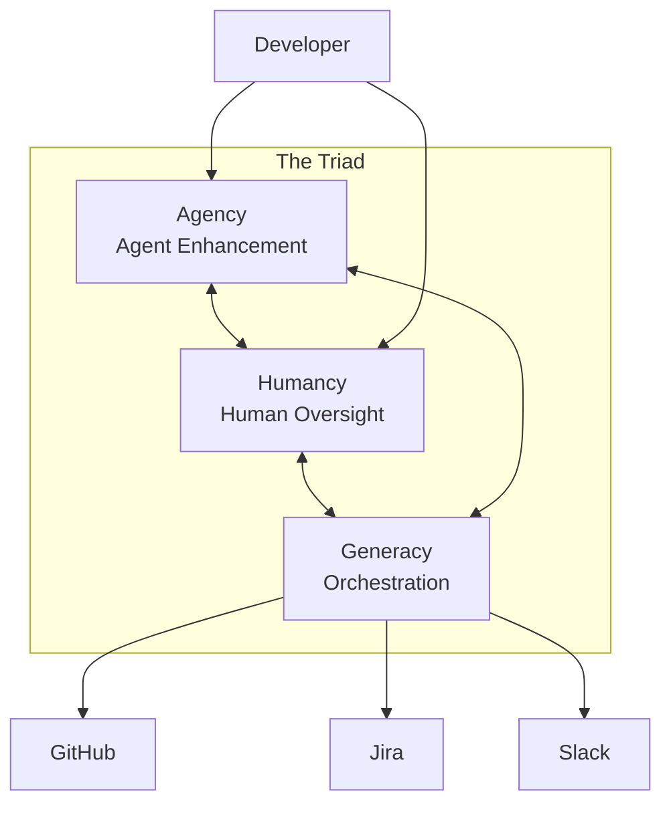
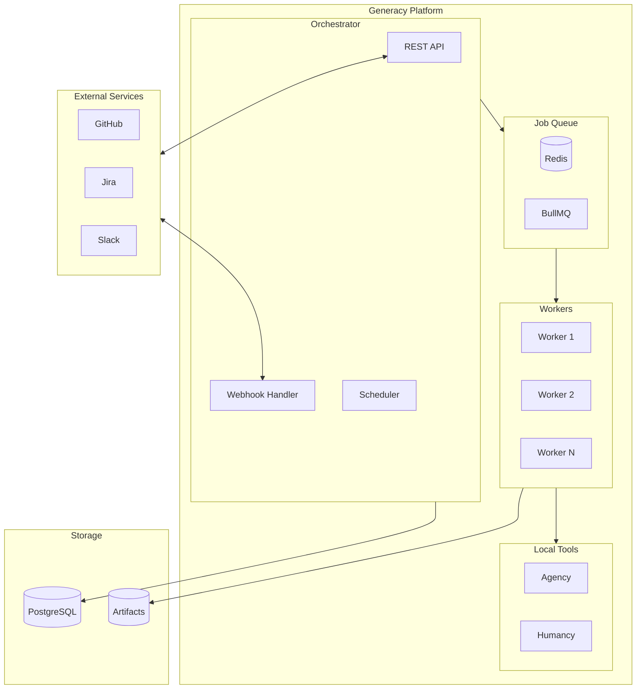
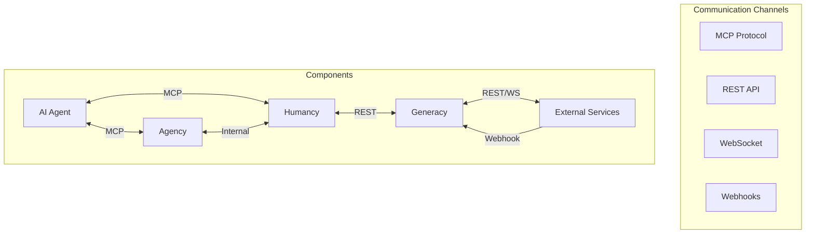
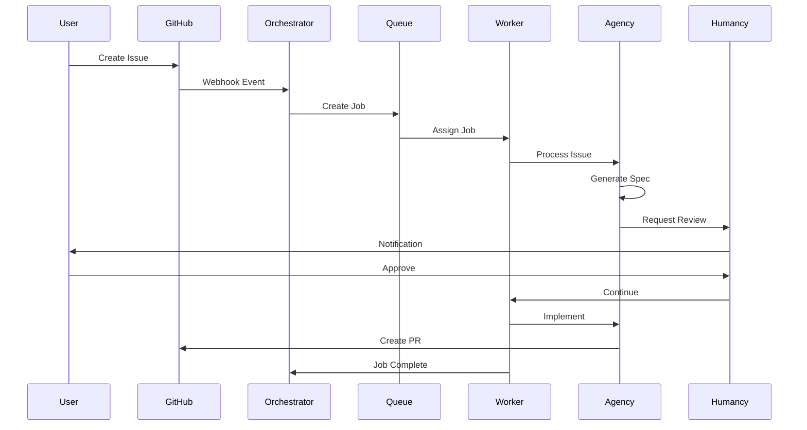
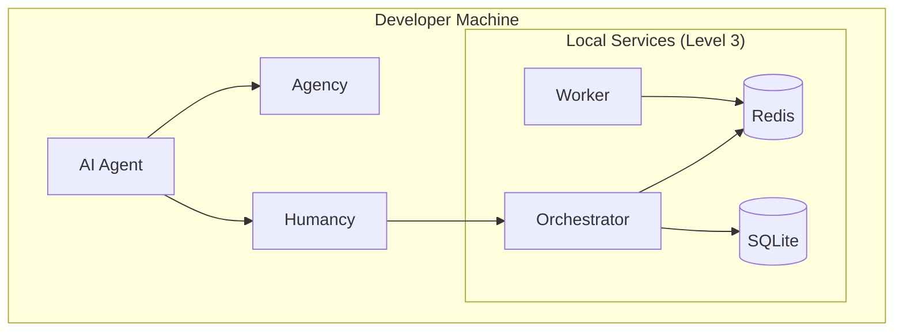
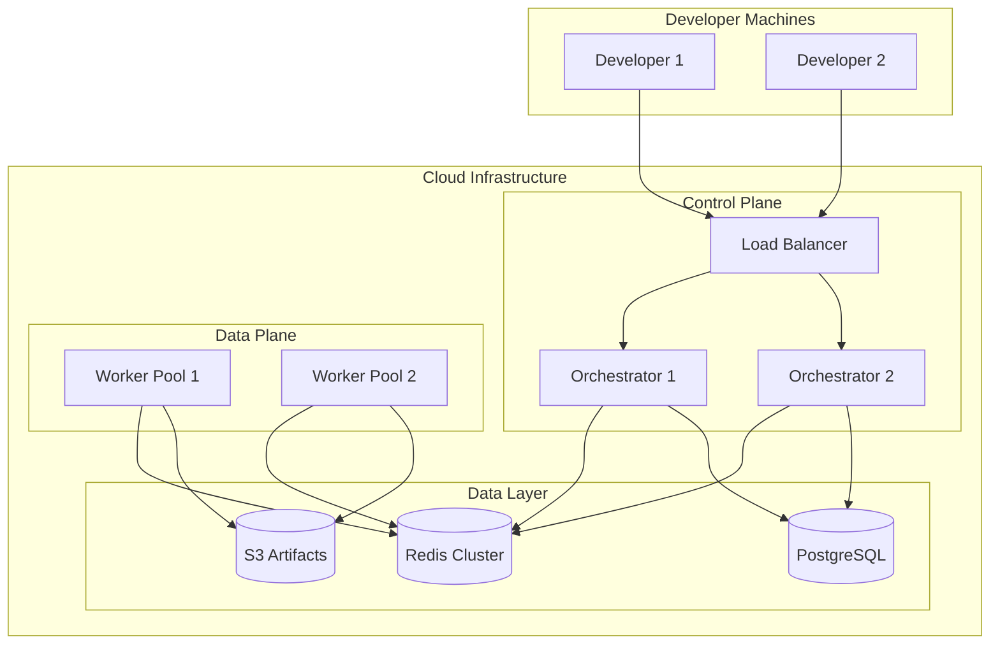

# Architecture Internals

> Looking for a high-level understanding of how Generacy works? See the [Architecture Overview](/docs/architecture/overview).

This document covers the internal implementation details of the Generacy orchestration layer — the queue infrastructure, database design, communication protocols, and deployment topology. This is useful for contributors, operators managing production deployments, and anyone who wants to understand how the system works under the hood.

## The Triad

The Generacy ecosystem is built around three interconnected components:

- **Agency** — Local agent enhancement layer. Extends AI coding assistants with MCP tools, context providers, and plugins. Runs entirely locally with no external dependencies.
- **Humancy** — Human oversight layer. Provides review gates, human-triggered commands, and audit trails for AI-assisted development.
- **Generacy** — Orchestration layer. Manages distributed job queues, multi-step workflow execution, and external service integrations.

## System Architecture

## Job Queue — Redis + BullMQ

We chose Redis with BullMQ for the job queue because:

- **Proven reliability** at scale with rich feature set (priorities, delays, retries)
- **Good observability** tools for monitoring queue health
- **Easy local development** — runs as a single container

### How Jobs Flow

1. The orchestrator's webhook handler receives a GitHub event (e.g., issue labeled with `process:speckit-feature`)
2. It creates a job in the BullMQ queue with the event payload, workflow name, and priority
3. An available worker pulls the job from the queue
4. The worker executes the current workflow phase (e.g., `specify`, `plan`, `implement`)
5. On completion, the worker reports the result back; the orchestrator decides what to enqueue next

BullMQ provides built-in support for:

- **Retry logic** — Failed jobs are retried with configurable backoff strategies
- **Dead-letter queues** — Jobs that exhaust retries are moved aside for inspection
- **Job prioritization** — Urgent work (e.g., error recovery) can jump the queue
- **Delayed jobs** — Used for scheduling retries and timeout enforcement
- **Concurrency control** — Each worker processes one job at a time to avoid resource contention

### Worker Processing Model

Workers are stateless processes that pull jobs from the queue. Each worker:

1. Dequeues a job from Redis
2. Resolves which workflow phase to execute (via the phase resolver)
3. Spawns an AI agent with the appropriate tools and context
4. Monitors execution against timeout limits
5. Reports results and updates workflow state

Multiple workers can run in parallel. In local development, a single worker suffices. In cloud deployments, dedicated worker pools handle load across repositories.

## State Management — PostgreSQL

PostgreSQL manages all persistent workflow state:

- **ACID compliance** ensures workflow state is never corrupted, even during failures
- **JSON support** enables flexible schemas for workflow metadata
- **Horizontal scaling** options for production deployments

### What State Is Tracked

| State | Description |
|-------|-------------|
| **Current phase** | Which workflow phase is active (e.g., `specify`, `plan`) |
| **Completed phases** | History of phases that have finished, with timestamps |
| **Label history** | Record of all labels added and removed during the workflow |
| **Error records** | Error details, exit codes, and retry counts |
| **GitHub references** | Associated issue URL, PR URL, branch name |
| **Workflow metadata** | Workflow name, version, input parameters, step outputs |

In local development (Level 3), SQLite replaces PostgreSQL for zero-configuration setup. The schema and queries are compatible across both backends. For the full schema definitions, see [Contracts](/docs/architecture/contracts).

## Communication Channels

The system uses four communication protocols, each suited to a different interaction pattern:

| Protocol | Used Between | Purpose |
|----------|-------------|---------|
| **MCP** | Agent ↔ Agency, Agent ↔ Humancy | Tool invocation, context injection, streaming responses |
| **REST** | Humancy ↔ Generacy, Generacy ↔ External | API calls, status queries, command dispatch |
| **WebSocket** | Generacy ↔ External services | Real-time event streaming |
| **Webhooks** | External services → Generacy | Inbound event notifications (GitHub, Jira, Slack) |

### Component Interaction

This sequence diagram shows how a typical issue flows through the system's internal components:

### MCP Protocol

We use the Model Context Protocol (MCP) for agent communication because:

- Standardized protocol adopted by multiple AI assistants
- Supports streaming and bidirectional communication
- Type-safe tool definitions
- Growing ecosystem support

For details on how each protocol is secured, see [Security](/docs/architecture/security).

## Deployment Architecture

### Local Development (Level 1–3)

At Level 3, the full orchestration stack runs locally. SQLite replaces PostgreSQL for zero-configuration local development.

### Cloud Deployment (Level 4)

Level 4 scales horizontally with multiple orchestrator instances behind a load balancer and dedicated worker pools. Redis Cluster provides high-availability queue infrastructure and PostgreSQL handles persistent state with full ACID guarantees.

### Worker Pool Configuration

Each worker container processes exactly one job at a time to ensure full isolation. Scale by adding container replicas, not by increasing concurrency within a single container.

The worker dispatcher controls polling and resilience through these settings:

| Setting | Default | Range | Description |
|---------|---------|-------|-------------|
| `pollIntervalMs` | 5000 | ≥ 1000 | Interval between queue polls (ms) |
| `heartbeatTtlMs` | 30000 | ≥ 5000 | Worker heartbeat TTL — stale workers are reaped after expiry |
| `heartbeatCheckIntervalMs` | 15000 | ≥ 5000 | Interval between heartbeat/reaper checks (ms) |
| `shutdownTimeoutMs` | 60000 | ≥ 5000 | Grace period for in-flight workers during shutdown (ms) |
| `maxRetries` | 3 | ≥ 1 | Maximum retry attempts before dead-lettering a job |

Each individual worker also has per-phase configuration:

| Setting | Default | Description |
|---------|---------|-------------|
| `phaseTimeoutMs` | 600000 (10 min) | Maximum time for a single phase execution |
| `maxTurns` | 100 | Maximum Claude CLI turns per phase |
| `workspaceDir` | `/tmp/orchestrator-workspaces` | Base directory for repository checkouts |
| `validateCommand` | `pnpm test && pnpm build` | Command run during the verification phase |

**Heartbeat mechanism** — Each worker refreshes a Redis key (`orchestrator:worker:{workerId}:heartbeat`) at half the TTL interval. The dispatcher's reaper loop removes workers whose heartbeats have expired, freeing their claimed jobs for retry.

**Dead-letter queue** — Jobs that exhaust `maxRetries` are moved to `orchestrator:queue:dead-letter` for manual inspection rather than being silently dropped.

## Progressive Adoption

The architecture supports progressive adoption:

| Level | Components | External Dependencies |
|-------|------------|----------------------|
| **Level 1** | Agency only | None (fully local) |
| **Level 2** | Agency + Humancy | None (fully local) |
| **Level 3** | Full local stack | Redis, SQLite |
| **Level 4** | Cloud deployment | Redis Cluster, PostgreSQL, S3 |

## Key Design Decisions

| Decision | Choice | Rationale |
|----------|--------|-----------|
| Job queue | Redis + BullMQ | Proven reliability at scale, rich primitives (priorities, delays, retries, dead-letter), good observability tooling, and trivial local setup (single container). |
| Persistent state | PostgreSQL | ACID compliance prevents workflow state corruption during failures, native JSON support for flexible workflow metadata, and horizontal scaling options for cloud deployments. SQLite serves as a drop-in replacement for local development (Level 3). |
| Agent communication | MCP (Model Context Protocol) | Standardized protocol adopted by multiple AI assistants, supports streaming and bidirectional communication, provides type-safe tool definitions, and benefits from a growing ecosystem. |
| Queue ↔ state separation | Redis for transient queue state, PostgreSQL for durable workflow state | Each store handles what it's best at — Redis provides fast, ephemeral job dispatch while PostgreSQL guarantees durable, queryable workflow history. |
| Worker model | Stateless, single-job workers | Simplifies scaling (add workers without coordination), isolates failures (one bad job doesn't affect others), and enables clean horizontal scaling in cloud deployments. |

For how these decisions affect the data flowing between components, see [Contracts](/docs/architecture/contracts). For the security implications of this architecture, see [Security](/docs/architecture/security).

## Next Steps

- [Architecture Overview](/docs/architecture/overview) — Adopter-focused system overview
- [Contracts](/docs/architecture/contracts) — Data contracts and schemas
- [Security](/docs/architecture/security) — Security model
