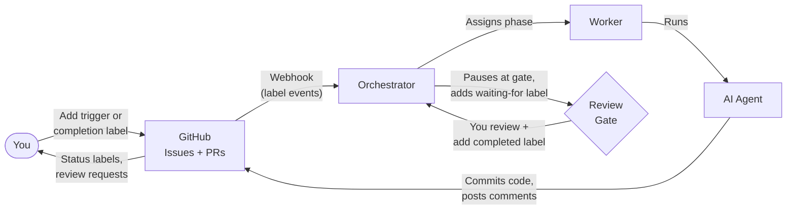

# Architecture Overview

Generacy is an orchestrated development platform that turns GitHub issues into pull requests through a structured, human-reviewed workflow. This document covers the **orchestrated workflow** (Level 3+), where an orchestrator coordinates AI agents to generate specifications, plans, and implementations — with you in the loop at every critical decision point.

If you're looking for simpler setups, see the [Level 1 (Agency only)](/docs/getting-started/level-1-agency-only) or [Level 2 (Agency + Humancy)](/docs/getting-started/level-2-agency-humancy) guides.

**What you'll learn:**

- How the system processes an issue end-to-end
- What labels drive the workflow and which ones you'll interact with
- How review and clarification cycles work
- How to customize workflows
- What to do when something goes wrong

## High-Level Architecture

At its core, Generacy connects GitHub to AI agents through an orchestrator. Labels on issues act as the communication protocol between you and the system.



**Orchestrator** — Receives GitHub webhooks, manages workflow state, and coordinates workers. It decides what phase to run next and when to pause for human review.

**Worker** — Executes workflow phases by running an AI agent with the right tools and context. Each worker handles one job at a time.

**AI Agent** — Performs the actual development work: writing specifications, generating plans, implementing code, and creating pull requests.

**Review Gates** — Pause points where the workflow waits for your input. The orchestrator adds a `waiting-for:*` label, and the workflow resumes when you add the corresponding `completed:*` label.

**Labels** — The primary interface between you and the system. You add labels to trigger workflows and signal review completion. The system adds labels to communicate status and indicate when your input is needed.

For internal architecture details (queue infrastructure, database design, deployment topology), see [Architecture Internals](/docs/architecture/internals).

## How It Works — Workflow Lifecycle

Here's what happens when you label a GitHub issue with `process:speckit-feature`. The workflow follows seven phases: setup, specification, clarification, planning, task generation, implementation, and verification.

### 1. You trigger the workflow

Write a GitHub issue describing the feature you want built, then add the `process:speckit-feature` label. The orchestrator receives the label event via webhook and enqueues a job. Within seconds, the issue gets an `agent:in-progress` label — the system is working on it.

### 2. Agent generates a specification

A worker picks up the job and runs an AI agent that reads your issue description. The agent creates a detailed feature specification (`spec.md`) in a new branch, commits it, and opens a **draft pull request**. You'll see a `phase:specify` label while this is happening.

### 3. Agent posts clarification questions

The agent analyzes the specification for ambiguities or missing details. If it has questions, it posts them as a comment on the issue. The workflow pauses: the issue receives a `waiting-for:clarification` label so you know action is needed. If there are no questions, the workflow continues automatically to the next phase.

### 4. You answer, workflow resumes

Reply to the clarification questions in the issue comments. When you're done, add the `completed:clarification` label. The orchestrator detects the completion signal and resumes the workflow — the agent reads your answers and incorporates them into the specification before moving on.

### 5. Agent plans and implements

The workflow now moves through three phases in sequence:

- **Planning** (`phase:plan`) — The agent generates an implementation plan describing which files to modify, what patterns to follow, and the order of changes. The plan is committed to the PR branch.
- **Task generation** (`phase:tasks`) — The agent breaks the plan into discrete, implementable tasks and commits a task breakdown (`tasks.md`) to the PR.
- **Implementation** (`phase:implement`) — The agent works through each task, writing code and committing changes to the PR branch. This phase has a one-hour timeout for large features.

You can optionally review the plan and tasks at their respective gate points (`waiting-for:plan-review`, `waiting-for:tasks-review`) before implementation begins. If these gates are configured, the workflow pauses and waits for your `completed:*` label before proceeding.

### 6. PR marked ready for review

Once implementation finishes, the agent runs verification — executing tests and linting (`phase:validate`). When verification passes, the draft PR is marked **ready for review**. You review it like any other pull request — checking the code, running it locally, and leaving comments.

### 7. Agent addresses feedback

If you leave review comments on the PR, the system detects them and the agent pushes commits addressing your feedback. The issue receives a `waiting-for:address-pr-feedback` label while the agent works. This cycle continues until you approve the PR and merge it.

### Stage Comments

As the workflow progresses, the system posts and updates **stage comments** on the issue. These structured comments give you a live view of where things stand without cluttering the issue with repeated status updates.

There are three stage comments, one per stage of the workflow:

- **📋 Specification** — covers the specify and clarify phases
- **📐 Planning** — covers the plan and tasks phases
- **🔨 Implementation** — covers the implement and validate phases

Each stage comment renders as a progress table:

| Phase | Status | Started | Completed |
|-------|--------|---------|-----------|
| specify | ✅ complete | 10:15 AM | 10:45 AM |
| clarify | 🔄 in_progress | 10:46 AM | — |

The comment also shows the overall stage status, timestamps, and a link to the PR once it exists. Stage comments are created when a stage begins and edited in place as phases complete — you'll never see duplicate progress comments. The status icons tell you at a glance what's happening: ⏳ pending, 🔄 in progress, ✅ complete, or ❌ error.

## Label Protocol

Labels are how you and the system communicate. They fall into two categories: labels you add and labels you observe.

### Labels You Add

**Trigger labels** start a workflow. **Completion labels** tell the system you've finished reviewing an artifact.

| Label | When to add | What happens |
|-------|-------------|--------------|
| `process:speckit-feature` | On an issue describing a feature | Orchestrator enqueues the issue for the full spec-driven workflow |
| `process:speckit-bugfix` | On an issue describing a bug | Orchestrator enqueues the issue for a streamlined bug fix workflow |
| `type:epic` | On an issue you want broken into child issues | Workflow generates child issues instead of a single PR |
| `completed:clarification` | After answering clarification questions | Workflow resumes from planning phase |
| `completed:spec-review` | After reviewing the specification | Workflow resumes from clarification phase |
| `completed:plan-review` | After reviewing the implementation plan | Workflow resumes from task generation |
| `completed:tasks-review` | After reviewing the task breakdown | Workflow resumes from implementation |

### Labels You'll Observe

These labels are managed by the system. You don't need to add or remove them — they tell you what's happening.

| Label | What it means | Action required |
|-------|---------------|-----------------|
| `agent:in-progress` | A worker is actively processing the issue | None — wait for it to finish |
| `agent:error` | Something went wrong | Check the error comment on the issue, then retry (see [Error Handling](#error-handling)) |
| `waiting-for:clarification` | Clarification questions posted | Answer questions in the issue comments, then add `completed:clarification` |
| `waiting-for:spec-review` | Specification ready for review | Review the spec in the draft PR, then add `completed:spec-review` |
| `waiting-for:plan-review` | Implementation plan ready for review | Review the plan in the draft PR, then add `completed:plan-review` |
| `waiting-for:tasks-review` | Task breakdown ready for review | Review tasks in the draft PR, then add `completed:tasks-review` |
| `waiting-for:address-pr-feedback` | Agent is addressing your PR review comments | None — the system handles this automatically |
| `needs:intervention` | Automated processing failed | Human investigation required |

### The Pattern

Every label interaction follows a consistent lifecycle:

```
trigger label → agent works → waiting-for label → you review → completed label → agent resumes
```

You only need to act when you see a `waiting-for:*` label — the rest is automatic. `completed:*` labels accumulate as a permanent record of which review gates have been passed.

## Clarification and Review Cycles

Every review point follows the same pattern:

1. The system completes a phase and produces an artifact (specification, plan, tasks, or code)
2. The system adds a `waiting-for:*` label and posts a comment explaining what needs review
3. The workflow pauses
4. You review the artifact and respond
5. You add the corresponding `completed:*` label
6. The system detects the completion signal, removes the waiting label, and resumes the workflow

You only need to act when you see a `waiting-for:*` label appear on the issue.

### Review Types

**Clarification** — `waiting-for:clarification` → `completed:clarification`

The agent posts questions as an issue comment when it needs more context about your requirements. Answer the questions in the issue thread, then add the completion label. The agent reads your answers and incorporates them into the specification before moving on.

**Spec Review** — `waiting-for:spec-review` → `completed:spec-review`

The agent has generated a specification document (`spec.md`, visible in the draft PR). Review it for accuracy and completeness — check that the requirements match your intent. The specification drives everything that follows, so this is the most impactful review point.

**Plan Review** — `waiting-for:plan-review` → `completed:plan-review`

The implementation plan (`plan.md`) describes how the agent intends to build the feature — which files to modify, what patterns to follow, and the sequence of changes. Review the plan in the PR and check that the approach is sound.

**Tasks Review** — `waiting-for:tasks-review` → `completed:tasks-review`

The task breakdown (`tasks.md`) splits the plan into discrete implementation steps. Review the tasks in the PR. This is your last checkpoint before code generation begins.

**PR Feedback** — `waiting-for:address-pr-feedback`

This works like a standard GitHub pull request review. Leave comments on the PR, and the agent will push commits addressing your feedback. No completion label is needed — the system detects new review comments and addresses them automatically.

### Gate Flow

Each review gate maps to a specific point in the workflow. When you add a `completed:*` label, the system resolves which phase to resume from:

| You add | System was waiting at | Workflow resumes with |
|---------|----------------------|----------------------|
| `completed:spec-review` | Specification phase | Clarification phase |
| `completed:clarification` | Clarification phase | Planning phase |
| `completed:plan-review` | Planning phase | Task generation phase |
| `completed:tasks-review` | Task generation phase | Implementation phase |

This means you control the pace: the workflow only advances past each gate when you signal that you're satisfied with the output. If you spot an issue during any review, you can leave feedback before adding the completion label — the agent will address it in the next phase.

## Customizing Workflows

Workflows are defined in YAML files that describe a sequence of phases and steps. Here's a simplified excerpt from the built-in `speckit-feature` workflow:

```yaml
name: speckit-feature
version: "1.1.0"

inputs:
  - name: description
    type: string
    required: true
  - name: issue_url
    type: string
    required: false

phases:
  - name: setup
    steps:
      - name: create-feature
        uses: speckit.create_feature
        with:
          description: ${{ inputs.description }}

  - name: specification
    steps:
      - name: specify
        uses: speckit.specify
        with:
          feature_dir: ${{ steps.create-feature.output.feature_dir }}
          issue_url: ${{ inputs.issue_url }}

  - name: clarification
    steps:
      - name: clarify
        uses: speckit.clarify
        with:
          feature_dir: ${{ steps.create-feature.output.feature_dir }}
```

> Simplified for illustration — the full workflow has 7 phases including planning, task generation, implementation, and verification. See actual workflow files for the complete definition.

### Workflow Structure

- **`name`** — Identifies the workflow. Matches the label suffix (e.g., `process:speckit-feature`).
- **`inputs`** — Parameters the workflow accepts. Each input has a `name`, `type`, and `required` flag.
- **`phases`** — Ordered list of phases the workflow executes.
- **`steps`** — Each phase contains one or more steps.
- **`uses`** — References a built-in action in `namespace.action` format (e.g., `speckit.specify`).
- **`with`** — Input parameters passed to the action. Supports `${{ }}` interpolation for referencing workflow inputs (`${{ inputs.description }}`) and previous step outputs (`${{ steps.create-feature.output.feature_dir }}`).
- **`timeout`** — Optional maximum execution time in milliseconds (e.g., `3600000` for one hour).
- **`continueOnError`** — Optional flag to allow the workflow to continue even if a step fails.

### Built-in Action Namespaces

| Namespace | Purpose | Examples |
|-----------|---------|----------|
| `speckit.*` | Specification, clarification, planning, task generation, implementation | `speckit.specify`, `speckit.plan`, `speckit.implement` |
| `verification.*` | Test and lint checking | `verification.check` with configurable `command` |
| `github.*` | Label management, PR operations | |
| `workflow.*` | Gate checking, flow control | |

A workflow authoring guide with full action parameter documentation is planned — check the docs for updates.

## Configuration Essentials

To connect Generacy to your repositories, you need three things:

**1. GitHub webhook** — Point a webhook at your orchestrator's URL. Required events: `issues`, `issue_comment`, `pull_request_review`, `pull_request_review_comment`.

**2. Watched repositories** — Configure which repositories the orchestrator should process:

```yaml
repositories:
  - owner: your-org
    repo: your-repo
    workflows:
      speckit-feature: true
      speckit-bugfix: true
```

**3. Credentials** — A GitHub App installation token or personal access token with read/write access to issues, pull requests, and contents.

For the full configuration reference, see [Generacy Configuration](/docs/reference/config/generacy).

## Error Handling

When something goes wrong during a workflow, the system adds an `agent:error` label to the issue and posts an error comment. The error comment includes:

- **Phase** where the failure occurred (e.g., `implement`, `validate`)
- **Exit code** or error type (e.g., `timeout`, `context_overflow`)
- **Duration** the phase ran before failing
- **Error details** with relevant log output
- **Suggested next steps** for recovery

If the issue cannot be retried automatically, the system adds a `needs:intervention` label instead — this means a human needs to investigate before the workflow can continue.

### How to Retry

1. Read the error comment on the issue to understand what went wrong
2. Fix the underlying problem if needed (see common scenarios below)
3. Remove the `agent:error` label from the issue
4. Either:
   - Re-add the trigger label (e.g., `process:speckit-feature`) to restart the workflow from the beginning, or
   - Add the appropriate `completed:*` label to resume from the last review gate (useful when the error occurred after a gate you've already passed)

### Common Scenarios

**Timeout** — The agent exceeded its time limit (typically one hour for implementation). This usually means the task is too large for a single pass. Break the issue into smaller, more focused pieces, or convert it to an epic with `type:epic` so the system generates child issues instead.

**Context overflow** — The combined size of the issue description, codebase context, and conversation exceeded the agent's capacity. Simplify the requirements, reduce the scope, or split the work into an epic with smaller child issues. Overly detailed issue descriptions with large code snippets are a common cause.

**Test failures** — The implementation didn't pass the verification phase. Review the test errors in the error comment and in the PR. The agent attempts to fix test failures automatically, but complex issues (flaky tests, environment-specific failures, or pre-existing broken tests) may require manual fixes. Push your fixes to the PR branch and re-trigger to continue.

**Merge conflicts** — The feature branch diverged from the base branch during implementation. Pull the latest changes from the base branch, resolve conflicts on the PR branch, then re-trigger the workflow. This is most common on long-running features in active repositories.

## Glossary

| Term | Definition |
|------|------------|
| **Orchestrator** | The central service that receives webhooks, manages workflow state, and coordinates workers |
| **Worker** | A process that executes workflow phases by running an AI agent |
| **Phase** | A discrete step in a workflow (e.g., specify, plan, implement) |
| **Gate** | A review point where the workflow pauses for human input |
| **Stage Comment** | A structured comment on the issue that shows workflow progress, updated in place |
| **Workflow** | A YAML definition describing the sequence of phases and steps to process an issue |
| **Action** | A reusable operation referenced by `uses` in a workflow step (e.g., `speckit.specify`) |

## Next Steps

- [Getting Started](/docs/getting-started/quick-start) — Set up Generacy from scratch
- Workflow Authoring Guide — Create custom workflows with built-in actions (coming soon)
- [Generacy Configuration](/docs/reference/config/generacy) — Full configuration reference
- [Architecture Internals](/docs/architecture/internals) — Internal implementation details (queue infrastructure, database design, deployment)
- [Contracts](/docs/architecture/contracts) — Data contracts and schemas
- [Security](/docs/architecture/security) — Security model
