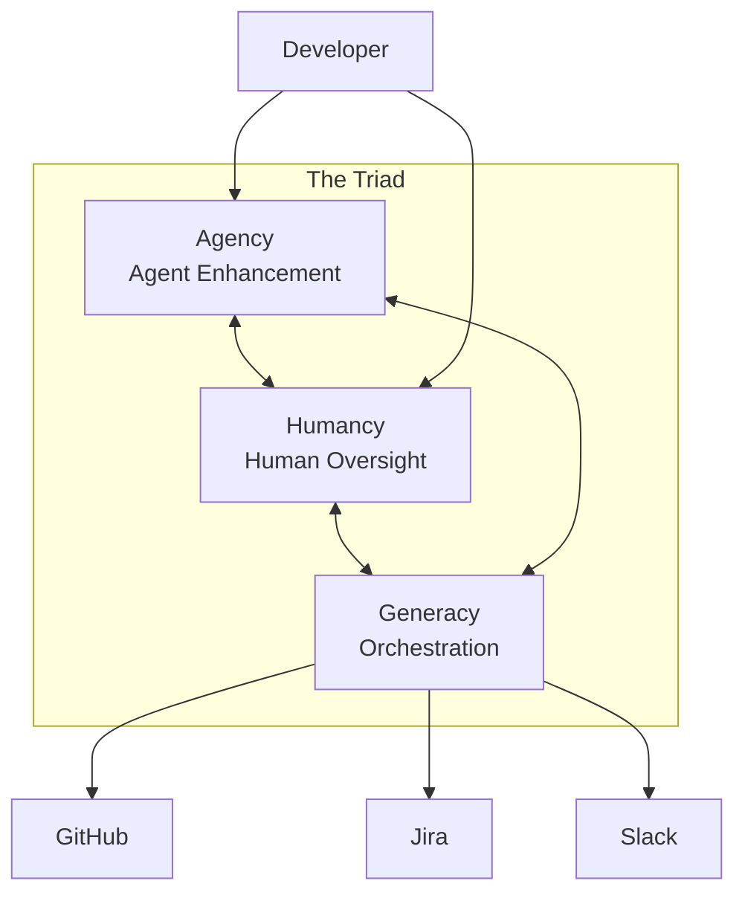
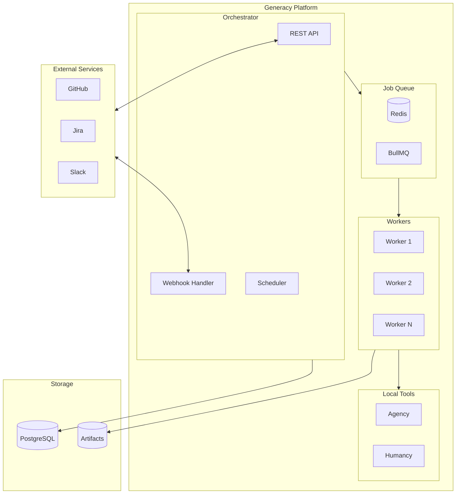
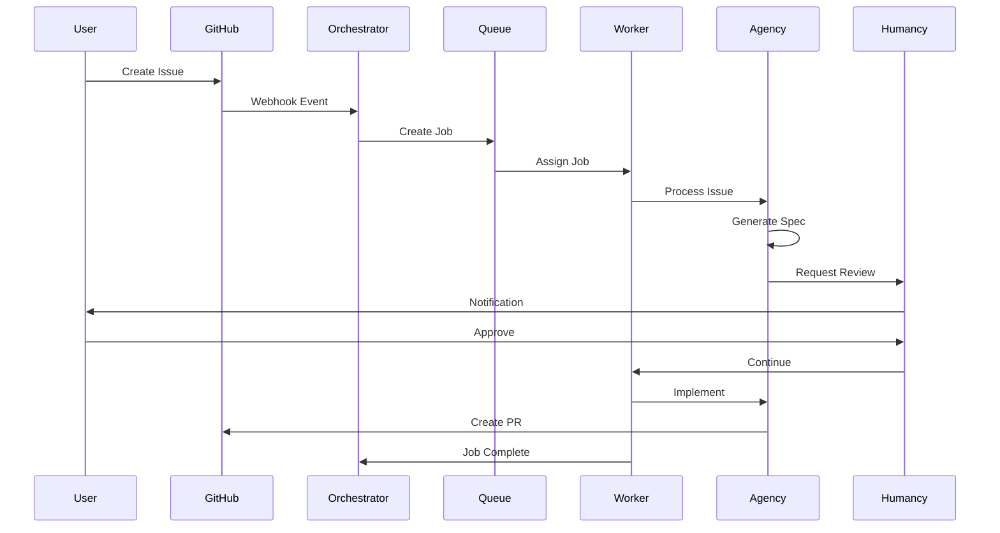
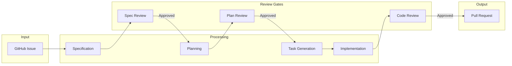
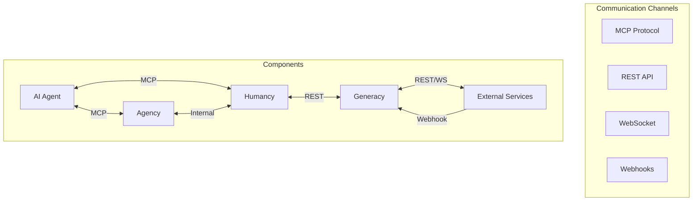
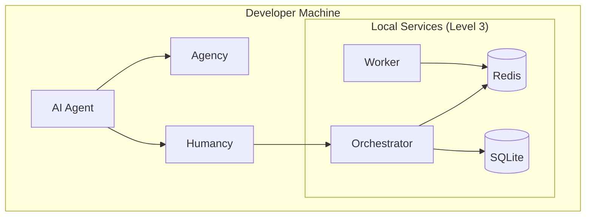
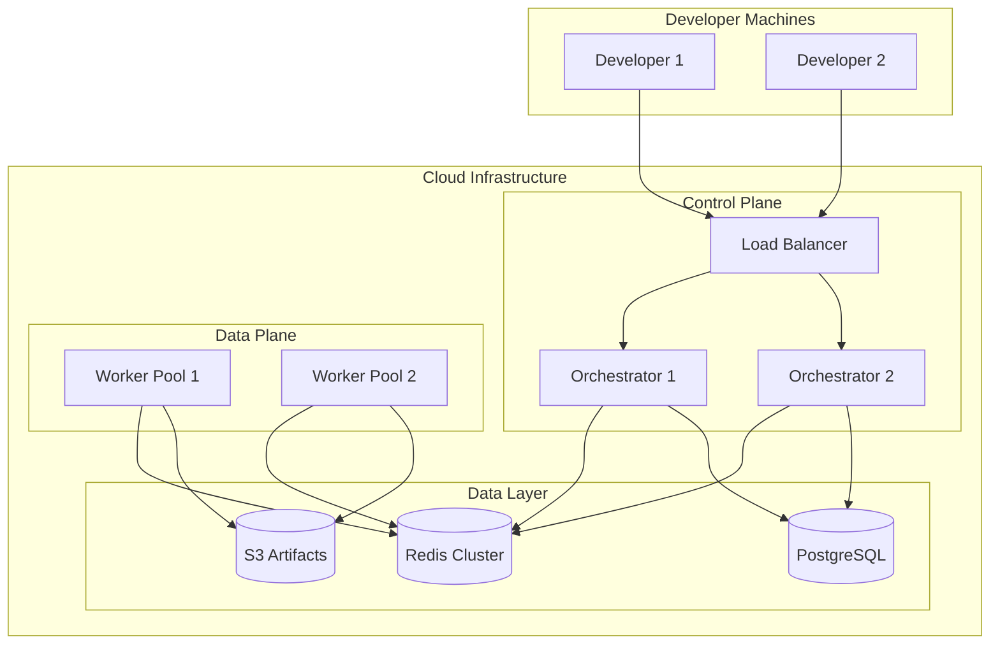

# Architecture Overview

Generacy is an agentic development platform built on three core components: Agency, Humancy, and Generacy (the orchestration layer). This document provides a comprehensive overview of the system architecture.

## The Triad

The Generacy ecosystem is built around three interconnected components:

### Agency

Agency is the local agent enhancement layer that extends AI coding assistants with:

- **MCP Tools** - Custom tools via Model Context Protocol
- **Context Providers** - Project-aware context injection
- **Plugins** - Extensible tool system

Agency runs entirely locally and requires no external services.

### Humancy

Humancy brings humans into the agentic loop with:

- **Review Gates** - Pause points for human approval
- **Commands** - Human-triggered workflow actions
- **Audit Trail** - Complete decision history

Humancy ensures human oversight of AI-assisted development.

### Generacy

Generacy orchestrates at scale:

- **Job Queue** - Distributed task management
- **Workflow Engine** - Multi-step workflow execution
- **Integrations** - External service connections

## System Architecture

### High-Level View

### Component Interaction

## Data Flow

### Issue Processing Flow

### Message Flow

## Deployment Architecture

### Local Development (Level 1-3)

### Cloud Deployment (Level 4)

## Key Design Decisions

### 1. MCP Protocol for Agent Communication

We use the Model Context Protocol (MCP) for agent communication because:

- Standardized protocol adopted by multiple AI assistants
- Supports streaming and bidirectional communication
- Type-safe tool definitions
- Growing ecosystem support

### 2. Redis + BullMQ for Job Queue

We chose Redis with BullMQ because:

- Proven reliability at scale
- Rich feature set (priorities, delays, retries)
- Good observability tools
- Easy local development

### 3. PostgreSQL for State

PostgreSQL provides:

- ACID compliance for workflow state
- JSON support for flexible schemas
- Excellent tooling ecosystem
- Horizontal scaling options

### 4. Progressive Adoption

The architecture supports progressive adoption:

- **Level 1**: Agency only (zero external dependencies)
- **Level 2**: Add Humancy (still fully local)
- **Level 3**: Add local orchestration
- **Level 4**: Scale to cloud

## Security Model

See [Security Documentation](/docs/architecture/security) for detailed security architecture.

## Next Steps

- [Contracts](/docs/architecture/contracts) - Data contracts and schemas
- [Security](/docs/architecture/security) - Security model
