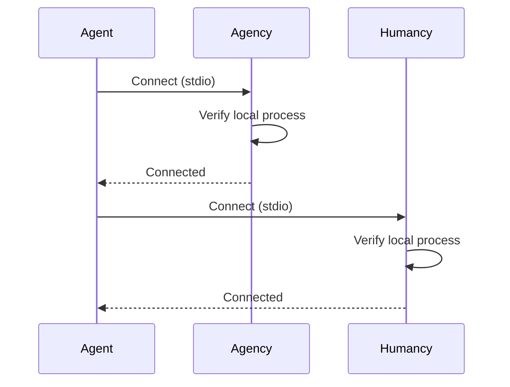
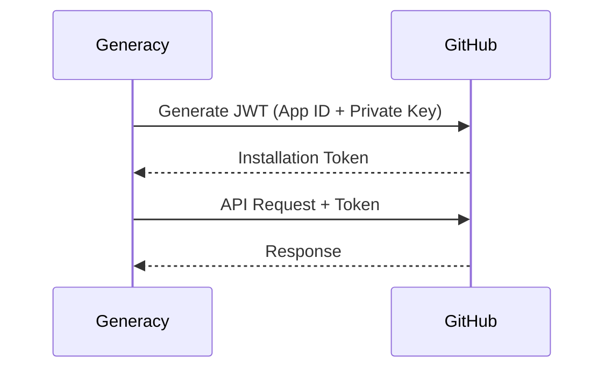
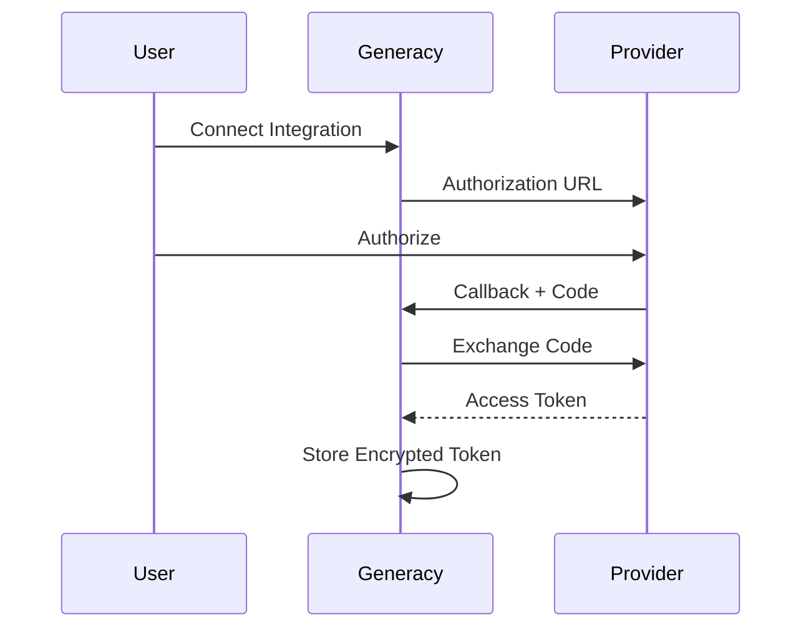
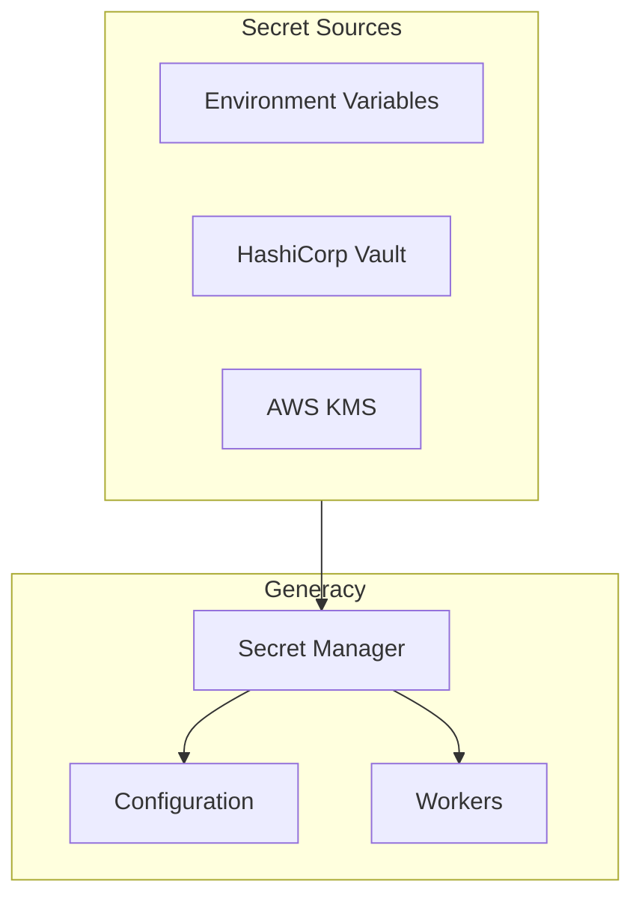
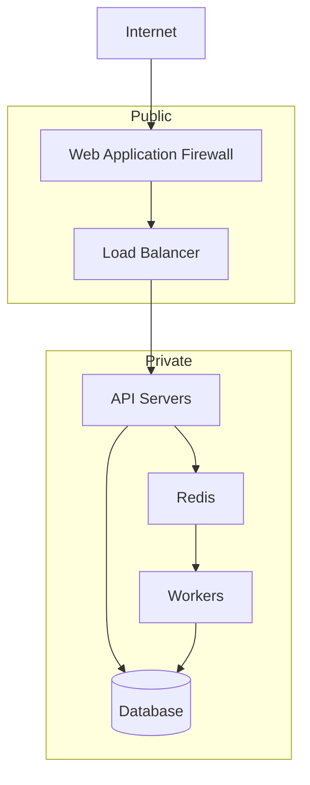

# Security Model

This document describes the security architecture and best practices for the Generacy platform.

## Security Principles

Generacy follows these core security principles:

1. **Defense in Depth** - Multiple layers of security controls
2. **Least Privilege** - Minimal permissions by default
3. **Zero Trust** - Verify all requests, trust nothing
4. **Transparency** - Clear audit trails for all actions

## Authentication

### API Authentication

Generacy uses bearer token authentication for API access:

```http
Authorization: Bearer <token>
```

Token types:
- **API Keys** - Long-lived keys for service-to-service
- **JWT Tokens** - Short-lived tokens for users
- **OAuth Tokens** - For third-party integrations

### MCP Authentication

MCP connections use local authentication:



### Integration Authentication

#### GitHub App



#### OAuth Integrations



## Authorization

### Role-Based Access Control (RBAC)

```typescript
interface Role {
  name: string;
  permissions: Permission[];
}

type Permission =
  | 'jobs:read'
  | 'jobs:write'
  | 'jobs:admin'
  | 'workflows:read'
  | 'workflows:write'
  | 'gates:read'
  | 'gates:approve'
  | 'integrations:read'
  | 'integrations:write'
  | 'admin:*';
```

Default roles:

| Role | Permissions |
|------|-------------|
| `viewer` | Read-only access |
| `developer` | Read + create jobs/workflows |
| `reviewer` | Developer + approve gates |
| `admin` | Full access |

### Gate Authorization

Review gates enforce authorization:

```typescript
interface GateAuthorization {
  // Who can approve
  allowedReviewers: string[];

  // Minimum approvals required
  requiredApprovals: number;

  // Teams that must approve
  requiredTeams?: string[];

  // Escalation path
  escalation?: {
    after: string;  // Duration
    to: string[];   // Reviewers
  };
}
```

## Data Security

### Encryption at Rest

- **Database**: PostgreSQL with encryption (AES-256)
- **Artifacts**: S3 with server-side encryption
- **Secrets**: Encrypted with master key
- **Tokens**: Encrypted before storage

### Encryption in Transit

- All API traffic uses TLS 1.3
- Internal services use mTLS
- Webhook payloads are signed

### Secret Management



Secrets are:
- Never logged
- Masked in UI
- Rotated regularly
- Scoped to minimum access

## Network Security

### Architecture



### Firewall Rules

| Source | Destination | Port | Allow |
|--------|-------------|------|-------|
| Internet | WAF | 443 | Yes |
| WAF | API | 3000 | Yes |
| API | Redis | 6379 | Yes |
| API | PostgreSQL | 5432 | Yes |
| Workers | Redis | 6379 | Yes |
| Workers | PostgreSQL | 5432 | Yes |

## Audit Logging

All security-relevant events are logged:

```typescript
interface AuditEvent {
  id: string;
  timestamp: Date;
  type: AuditEventType;
  actor: {
    type: 'user' | 'service' | 'system';
    id: string;
    ip?: string;
  };
  resource: {
    type: string;
    id: string;
  };
  action: string;
  result: 'success' | 'failure';
  metadata: Record<string, unknown>;
}

type AuditEventType =
  | 'auth.login'
  | 'auth.logout'
  | 'auth.failed'
  | 'api.request'
  | 'gate.approve'
  | 'gate.reject'
  | 'integration.connect'
  | 'config.change'
  | 'secret.access';
```

## Vulnerability Management

### Dependency Scanning

- Automated scanning with Snyk/Dependabot
- Critical vulnerabilities block deployment
- Weekly security updates

### Code Scanning

- Static analysis (CodeQL)
- Secret detection (git-secrets)
- Container scanning

### Penetration Testing

- Annual third-party penetration tests
- Bug bounty program (planned)

## Compliance

### Data Handling

- **Data Minimization**: Collect only necessary data
- **Data Retention**: Configurable retention policies
- **Data Portability**: Export user data on request
- **Data Deletion**: Complete deletion on request

### Standards

Generacy aligns with:

- **SOC 2 Type II** (planned)
- **GDPR** compliance
- **OWASP Top 10** mitigations

## Security Best Practices

### For Administrators

1. **Enable MFA** for all admin accounts
2. **Rotate secrets** regularly
3. **Review audit logs** weekly
4. **Update dependencies** promptly
5. **Use least privilege** for service accounts

### For Developers

1. **Never commit secrets** to repositories
2. **Use environment variables** for configuration
3. **Validate all inputs** in plugins
4. **Enable rate limiting** for APIs
5. **Log security events** appropriately

### For Plugin Authors

1. **Validate inputs** thoroughly
2. **Use parameterized queries** for databases
3. **Sanitize outputs** to prevent XSS
4. **Request minimum permissions**
5. **Handle errors** without leaking information

## Incident Response

### Reporting

Report security issues to: security@generacy.ai

### Response Process

1. **Triage** - Assess severity and impact
2. **Contain** - Limit damage spread
3. **Investigate** - Determine root cause
4. **Remediate** - Fix the vulnerability
5. **Communicate** - Notify affected parties
6. **Review** - Improve processes

### Severity Levels

| Level | Response Time | Example |
|-------|---------------|---------|
| Critical | 1 hour | Active exploitation |
| High | 4 hours | Auth bypass |
| Medium | 24 hours | XSS vulnerability |
| Low | 1 week | Information disclosure |

## Next Steps

- [Overview](/docs/architecture/overview) - Architecture overview
- [Contracts](/docs/architecture/contracts) - Data contracts
