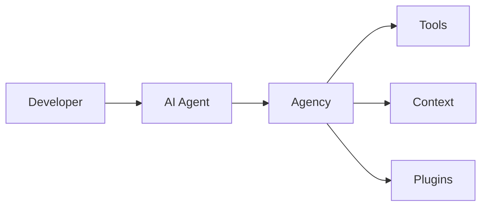
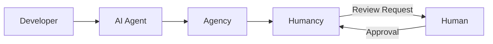

# Adoption Levels

Generacy supports four levels of progressive adoption. You can start with Level 1 and move to higher levels as your needs grow — each level builds on the previous one without requiring you to rework existing configuration.

## Overview

| Level | Components | What You Get | Complexity |
|-------|------------|-------------|------------|
| **Level 1** | Agency | Local agent enhancement — custom tools, context providers, local plugins | Low |
| **Level 2** | Agency + Humancy | Add human oversight — review gates, approval workflows, audit trail | Medium |
| **Level 3** | Full Local | Complete local stack — orchestration, job queues, multi-agent coordination | High |
| **Level 4** | Cloud | Team/enterprise deployment — cloud orchestration, shared dashboards, CI/CD integration | High |

:::tip
If you followed the [Getting Started guide](./index.md), you already have a Level 1 setup. Read the Level 1 section below to get the most out of it, then explore higher levels when you're ready.
:::

---

## Level 1: Agency Only

Agency provides local agent enhancement without requiring any cloud services or external dependencies. This is the recommended starting point.

### What It Provides

At Level 1, you use Agency to enhance your AI coding assistant with:

- **Custom Tools** — extend agent capabilities with project-specific tools
- **Context Providers** — give agents better understanding of your codebase
- **Local Plugins** — add functionality without external services

### Architecture



### MCP Configuration

Add Generacy to your AI assistant's MCP configuration:

```json title=".claude/settings.json"
{
  "mcpServers": {
    "generacy": {
      "command": "generacy",
      "args": ["mcp"]
    }
  }
}
```

For other agents, see [First Workflow](./first-workflow.md) for configuration examples.

### Built-in Tools

Agency comes with several built-in tools:

| Tool | Description |
|------|-------------|
| `project-info` | Get project metadata and structure |
| `file-search` | Enhanced file search capabilities |
| `code-analysis` | Analyze code patterns and dependencies |
| `task-management` | Track and manage development tasks |

### Context Providers

Agency automatically provides context about:

- Project structure and configuration
- Dependencies and their versions
- Recent changes and git history
- Code patterns and conventions

### Local Plugins

Add plugins for project-specific functionality:

```json title=".agency/config.json"
{
  "plugins": [
    "./plugins/my-custom-tool"
  ]
}
```

### Configuration

```json title=".agency/config.json"
{
  "version": "1.0",
  "project": {
    "name": "my-project",
    "type": "node"
  },
  "tools": {
    "enabled": ["project-info", "file-search", "code-analysis"]
  }
}
```

For all available options, see the [Agency Configuration Reference](/docs/guides/agency/configuration).

### Best Practices

1. **Start simple** — enable only the tools you need
2. **Add context gradually** — let Agency learn your project patterns
3. **Create local plugins** — build tools specific to your workflow
4. **Review tool usage** — monitor which tools are most helpful

---

## Level 2: Agency + Humancy

Humancy brings humans into the agentic loop. It builds on Agency to add review gates, approvals, and human-in-the-loop processes.

### What It Adds

- **Review Gates** — pause workflows for human approval
- **Approval Workflows** — structured multi-step review processes
- **Commands** — human-triggered actions in agent workflows (`/approve`, `/reject`, `/hold`, `/skip`)
- **Audit Trail** — track all human decisions

### Architecture



### Getting Started with Level 2

1. Install Humancy: `npm install -g @generacy-ai/humancy`
2. Initialize in your project: `humancy init`
3. Add Humancy to your MCP configuration alongside Agency

For the full Level 2 setup walkthrough, configuration options, and workflow examples, see the [Humancy Guide](/docs/guides/humancy/overview).

---

## Level 3: Local Orchestration

Level 3 adds the full Generacy orchestration layer to your local setup — multi-agent coordination, job queues, and workflow management, all running on your machine.

### What It Adds

- **Multi-agent orchestration** — coordinate multiple AI agents working on different tasks
- **Job queues** — manage and prioritize work across agents
- **Workflow automation** — define complex workflows with dependencies and triggers
- **Local dashboard** — monitor agent activity and workflow progress

### When to Use Level 3

Level 3 is a good fit when you need to run multiple agents concurrently or manage workflows that span several steps and branches. It runs entirely locally and doesn't require cloud infrastructure.

For the full Level 3 setup guide, see [Level 3: Local Orchestration](./level-3-local-orchestration.md).

---

## Level 4: Cloud

Level 4 moves orchestration to the cloud for team-wide and enterprise deployments. It adds shared dashboards, CI/CD integration, and centralized management.

### What It Adds

- **Cloud orchestration** — run agents and workflows in the cloud
- **Shared dashboards** — team-wide visibility into agent activity and workflow status
- **CI/CD integration** — trigger workflows from your CI/CD pipeline
- **Centralized configuration** — manage projects and credentials across your organization

### When to Use Level 4

Level 4 is designed for teams that need shared infrastructure, persistent workflows, and centralized management. It builds on everything from Levels 1–3 and adds cloud-hosted services.

For the full Level 4 setup guide, see [Level 4: Cloud](./level-4-cloud.md).

---

## Choosing Your Level

| Question | Recommendation |
|----------|---------------|
| Just getting started with AI agents? | **Level 1** — minimal setup, immediate value |
| Need human approval before agents act? | **Level 2** — adds review gates and audit trail |
| Running multiple agents on complex tasks? | **Level 3** — local orchestration and job queues |
| Deploying across a team or organization? | **Level 4** — cloud infrastructure and shared dashboards |

You can upgrade from one level to the next at any time. Each level is additive — you keep everything from the previous level and add new capabilities on top.
