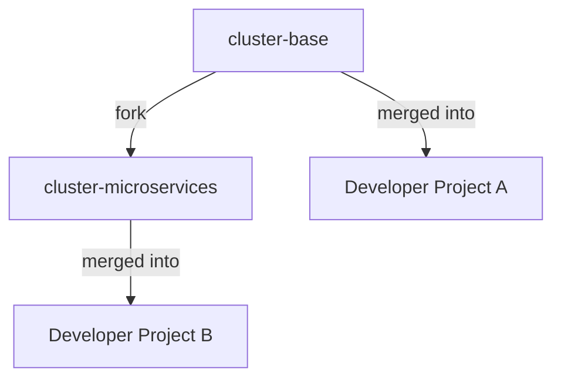

# Cluster Setup

Generacy uses **cluster base repos** to provide your project with a pre-configured dev container setup, orchestrator scripts, and workflow definitions. Instead of copying static template files, base repos are merged into your project as a Git remote — giving you a persistent upstream relationship that lets you pull updates with a standard `git merge`.

:::tip What is a "cluster"?
A **cluster** is the set of containers and configuration that make up your local development environment — the orchestrator, workers, Redis queue, and all supporting scripts. The cluster base repo provides the starting point for this setup, and you customize it for your project.
:::

## Fork Chain

The base repos form a fork chain where each level inherits from its parent and adds capabilities:



- **`cluster-base`** is the root — it contains the standard dev container setup without Docker-in-Docker
- **`cluster-microservices`** is a fork of `cluster-base` — it adds Docker-in-Docker support for running containerized services inside the dev container

Changes to `cluster-base` (core scripts, Dockerfile improvements, workflow updates) flow downstream into all forks via GitHub's standard upstream sync.

### Which variant do I need?

| Variant | Use Case | Includes DinD | When to Choose |
|---------|----------|:---:|----------------|
| `cluster-base` | Standard dev environment | No | Single-repo projects, no container builds needed |
| `cluster-microservices` | Microservices with Docker-in-Docker | Yes | Multi-repo projects that build/run Docker containers locally |

:::caution
Pick one variant per project. A project should track exactly one upstream base repo — either `cluster-base` or `cluster-microservices`, not both.
:::

## New Project Setup

When you run `generacy init` or the GitHub App onboards your project, an **onboarding PR** is created that merges the appropriate base repo into your project. This is a merge commit (not a file copy), which establishes the Git upstream relationship.

If you need to set up the cluster base repo manually — for example, to add it to an existing project that was onboarded before this approach — follow these steps:

### Step 1: Add the base repo as a remote

```bash
git remote add cluster-base https://github.com/generacy-ai/cluster-base.git
```

Replace `cluster-base` with `cluster-microservices` if your project needs Docker-in-Docker support:

```bash
git remote add cluster-base https://github.com/generacy-ai/cluster-microservices.git
```

:::tip
The remote is named `cluster-base` regardless of which variant you use. This keeps commands consistent and matches what the automation expects.
:::

### Step 2: Fetch and merge

```bash
git fetch cluster-base
git merge cluster-base/main --allow-unrelated-histories
```

The `--allow-unrelated-histories` flag is required because the base repo has no common ancestor with your project. This is a one-time requirement — future merges won't need it.

### Step 3: Review the merged files

After the merge, you'll see new files in your project:

```
.devcontainer/
├── Dockerfile
├── devcontainer.json
├── docker-compose.yml
├── .env.template
├── .env.local.template
├── .gitattributes
└── scripts/
    ├── entrypoint-orchestrator.sh
    ├── entrypoint-worker.sh
    ├── setup-credentials.sh
    ├── setup-speckit.sh
    └── resolve-workspace.sh
.generacy/
├── speckit-feature.yaml
└── speckit-bugfix.yaml
.agency/
└── config.json
.claude/
└── autodev.json
```

### Step 4: Commit and push

```bash
git push origin HEAD
```

The upstream relationship is now established. Future updates can be pulled with a standard `git merge` (see below).

## Updating Your Cluster Setup

When the base repo is updated with new scripts, Dockerfile improvements, or workflow changes, you can pull those updates into your project:

### Step 1: Fetch the latest changes

```bash
git fetch cluster-base
```

### Step 2: Merge the updates

```bash
git merge cluster-base/main
```

No `--allow-unrelated-histories` flag is needed after the initial setup — Git recognizes the shared history from the first merge.

### Step 3: Review and resolve any conflicts

If you've customized files that were also updated upstream (e.g., the Dockerfile), Git will flag merge conflicts for you to resolve. See [Troubleshooting](#troubleshooting) below for common scenarios.

### Step 4: Push

```bash
git push origin HEAD
```

## Tracking File: cluster-base.json

The onboarding process creates a `.generacy/cluster-base.json` file in your project root that tracks the upstream relationship:

```json
{
  "remote": "https://github.com/generacy-ai/cluster-base.git",
  "mergedSha": "abc123def456",
  "mergedAt": "2026-03-09T12:00:00Z"
}
```

| Field | Description |
|-------|-------------|
| `remote` | URL of the upstream base repo |
| `mergedSha` | Commit SHA of the last merge from the base repo |
| `mergedAt` | Timestamp of the last merge |

This file enables:
- The Generacy web UI to detect when updates are available
- CLI tooling to automate the fetch-and-merge workflow
- Visibility into which version of the base repo your project is running

:::caution
Do not delete or manually edit `cluster-base.json`. It is updated automatically when you merge from the upstream base repo.
:::

## Troubleshooting

### Merge conflicts after updating

Merge conflicts occur when you've modified files that were also updated in the base repo. This is expected — Git's merge resolution handles it naturally.

**Common conflict scenarios:**

| File | Likely Cause | Resolution |
|------|-------------|------------|
| `.devcontainer/Dockerfile` | You added custom build steps | Keep your customizations and incorporate the upstream changes (new stages, updated base images) |
| `.devcontainer/docker-compose.yml` | You added custom services or environment variables | Merge both — keep your services, accept upstream structural changes |
| `.devcontainer/devcontainer.json` | You modified features or settings | Review both versions and combine as needed |

**General resolution steps:**

1. Open the conflicting file and look for conflict markers (`<<<<<<<`, `=======`, `>>>>>>>`)
2. Keep your project-specific customizations
3. Incorporate the upstream changes (new scripts, updated paths, version bumps)
4. Stage the resolved file: `git add <file>`
5. Complete the merge: `git commit`

### Remote not found

If `git fetch cluster-base` fails with "remote not found", the remote hasn't been added yet:

```bash
git remote add cluster-base https://github.com/generacy-ai/cluster-base.git
git fetch cluster-base
```

### Permission denied

Ensure you have read access to the `generacy-ai/cluster-base` (or `generacy-ai/cluster-microservices`) repository. Contact your organization admin if access is denied.

### Divergent branches warning

If Git warns about divergent branches during merge, this is normal for the first merge. Use:

```bash
git merge cluster-base/main --allow-unrelated-histories
```

For subsequent merges, this flag is not needed. If you still see the warning, ensure your Git configuration allows merge commits:

```bash
git config pull.rebase false
```
