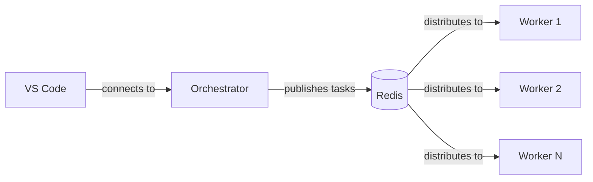

# Dev Environment

Generacy projects can use [Dev Containers](https://containers.dev/) to provide a pre-configured development environment with all required tooling installed automatically. This page covers how the dev container is set up and how to use it.

:::tip Optional for Level 1
If you're starting with Level 1 (Agency Only) and don't need Docker, you can skip this page and go directly to [Verify Setup](./verify-setup.md). The dev container is most useful for Level 2+ setups and multi-repo projects.
:::

## What the Dev Container Provides

When you open your project in a dev container, the [Generacy Dev Container Feature](https://github.com/generacy-ai/generacy/tree/develop/packages/devcontainer-feature) automatically installs:

| Tool | Description |
|------|-------------|
| **Node.js** | Runtime for Generacy CLI and tooling (skipped if already present) |
| **GitHub CLI** (`gh`) | GitHub operations from the terminal (skipped if already present) |
| **Generacy CLI** | `@generacy-ai/generacy` — project management and orchestration |
| **Agency MCP Server** | `@generacy-ai/agency` — local agent enhancement tools |
| **Claude Code** | AI coding assistant (can be disabled via feature options) |

The VS Code extensions `generacy-ai.agency` and `generacy-ai.generacy` are also automatically installed in the container.

## Single-Repo Setup

For single-repo projects, `generacy init` generates a `.devcontainer/devcontainer.json` that uses a base image with the Generacy feature:

```json title=".devcontainer/devcontainer.json"
{
  "name": "My Project",
  "image": "mcr.microsoft.com/devcontainers/typescript-node:22",
  "features": {
    "ghcr.io/generacy-ai/generacy/generacy:1": {}
  },
  "customizations": {
    "vscode": {
      "extensions": [
        "generacy-ai.agency",
        "generacy-ai.generacy"
      ]
    }
  }
}
```

No Docker Compose is needed — the container runs directly from the base image.

## Multi-Repo Setup

Multi-repo projects use Docker Compose to orchestrate multiple services. `generacy init` generates both a `devcontainer.json` and a `docker-compose.yml` in the `.devcontainer/` directory.

### Services

The generated `docker-compose.yml` defines three services:

| Service | Purpose |
|---------|---------|
| **redis** | Message queue for orchestrator/worker communication (Redis 7 Alpine) |
| **orchestrator** | Main development container with all repos mounted — this is the service you connect to |
| **worker** | Parallel task execution containers, scaled to your configured `workerCount` |

### Architecture



All services share a bridge network and can communicate with each other. The orchestrator and workers mount your repositories as workspace folders, and environment variables are loaded from `.generacy/generacy.env`.

## Opening in VS Code

### Reopen in Container

If you already have the project open in VS Code:

1. Open the Command Palette (**Ctrl+Shift+P** / **Cmd+Shift+P**)
2. Select **Dev Containers: Reopen in Container**
3. VS Code rebuilds and connects to the container

### Clone into Container Volume

To start fresh with a container volume (better I/O performance):

1. Open the Command Palette
2. Select **Dev Containers: Clone Repository in Container Volume...**
3. Enter your repository URL

### From the Terminal

Using the [Dev Container CLI](https://github.com/devcontainers/cli):

```bash
devcontainer up --workspace-folder .
devcontainer exec --workspace-folder . bash
```

## Starting Docker Compose (Multi-Repo)

For multi-repo projects, Docker Compose starts automatically when you open the dev container in VS Code. To start it manually:

```bash
docker compose -f .devcontainer/docker-compose.yml up -d
```

Expected output:

```
[+] Running 4/4
 ✔ Network proj_myproject-network  Created
 ✔ Container proj_myproject-redis  Started
 ✔ Container proj_myproject-orchestrator  Started
 ✔ Container proj_myproject-worker-1  Started
```

## Verifying the Container

Once connected, verify that the Generacy tooling is available:

```bash
generacy --version     # Generacy CLI
gh --version           # GitHub CLI
node --version         # Node.js
```

For multi-repo setups, check that all services are healthy:

```bash
docker compose -f .devcontainer/docker-compose.yml ps
```

You should see all services in a `running` (healthy) state.

## Customizing the Dev Container Feature

You can customize what gets installed by passing options to the Generacy feature:

```json title=".devcontainer/devcontainer.json"
{
  "features": {
    "ghcr.io/generacy-ai/generacy/generacy:1": {
      "version": "0.1.0",
      "installClaudeCode": false,
      "installAgency": true,
      "nodeVersion": "20"
    }
  }
}
```

| Option | Default | Description |
|--------|---------|-------------|
| `version` | `latest` | Version of `@generacy-ai/generacy` to install |
| `agencyVersion` | `latest` | Version of `@generacy-ai/agency` to install |
| `installClaudeCode` | `true` | Install Claude Code AI agent |
| `installAgency` | `true` | Install the Agency MCP server |
| `nodeVersion` | `22` | Node.js major version (if Node.js is not already present) |

## Supported Base Images

The Generacy feature supports **Debian/Ubuntu-based** dev container images:

- `mcr.microsoft.com/devcontainers/typescript-node`
- `mcr.microsoft.com/devcontainers/python`
- `mcr.microsoft.com/devcontainers/base:ubuntu`

Alpine, RHEL, and other non-Debian distributions are not currently supported.

## Next Steps

With your dev environment ready:

- **Configure your cluster setup** — If your project uses a cluster base repo, see [Cluster Setup](./cluster-setup.md) to understand the upstream relationship and how to pull updates.
- **Verify your setup** — Proceed to [Verify Setup](./verify-setup.md) to validate that everything is working correctly.
