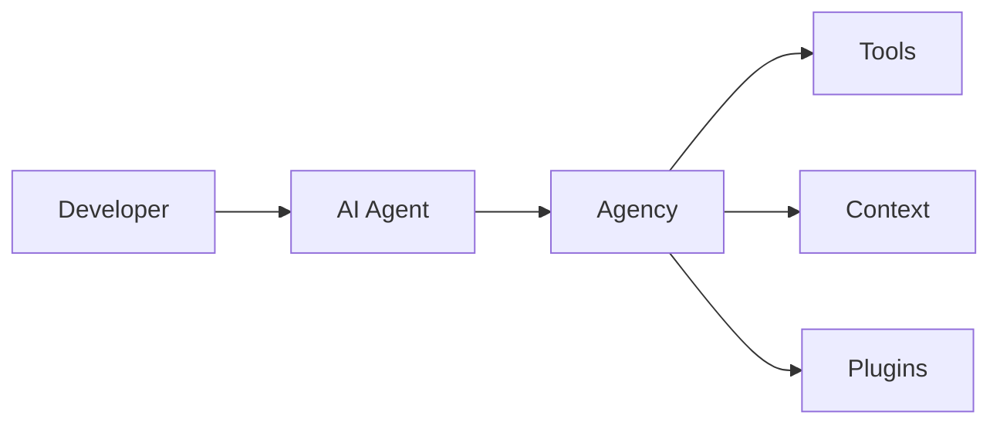

# Level 1: Agency Only

Agency provides local agent enhancement without requiring any cloud services or external dependencies.

## Overview

At Level 1, you're using Agency to enhance your AI coding assistant with:

- **Custom Tools** - Extend agent capabilities with project-specific tools
- **Context Providers** - Give agents better understanding of your codebase
- **Local Plugins** - Add functionality without external services



## Getting Started

### 1. Initialize Agency

```bash
cd your-project
agency init
```

### 2. Configure Your Agent

Add Agency to your AI assistant's MCP configuration:

```json title=".claude/settings.json"
{
  "mcpServers": {
    "agency": {
      "command": "agency",
      "args": ["mcp"]
    }
  }
}
```

### 3. Explore Available Tools

Ask your AI assistant to list available Agency tools:

```
What tools does Agency provide?
```

## Core Features

### Built-in Tools

Agency comes with several built-in tools:

| Tool | Description |
|------|-------------|
| `project-info` | Get project metadata and structure |
| `file-search` | Enhanced file search capabilities |
| `code-analysis` | Analyze code patterns and dependencies |
| `task-management` | Track and manage development tasks |

### Context Providers

Agency automatically provides context about:

- Project structure and configuration
- Dependencies and their versions
- Recent changes and git history
- Code patterns and conventions

### Local Plugins

Add plugins for project-specific functionality:

```json title=".agency/config.json"
{
  "plugins": [
    "./plugins/my-custom-tool"
  ]
}
```

## Configuration Options

### Basic Configuration

```json title=".agency/config.json"
{
  "version": "1.0",
  "project": {
    "name": "my-project",
    "type": "node"
  },
  "tools": {
    "enabled": ["project-info", "file-search", "code-analysis"]
  }
}
```

### Advanced Options

See the [Agency Configuration Reference](/docs/guides/agency/configuration) for all available options.

## Best Practices

1. **Start Simple** - Enable only the tools you need
2. **Add Context Gradually** - Let Agency learn your project patterns
3. **Create Local Plugins** - Build tools specific to your workflow
4. **Review Tool Usage** - Monitor which tools are most helpful

## Troubleshooting

### Tools Not Appearing

1. Verify Agency is running: `agency status`
2. Check MCP connection in your agent settings
3. Restart your AI assistant

### Performance Issues

1. Reduce enabled tools
2. Check plugin performance
3. Review context provider settings

## Next Steps

When you're ready to add human oversight to your workflow:

- [Level 2: Agency + Humancy](/docs/getting-started/level-2-agency-humancy) - Add review gates
- [Plugin Development](/docs/plugins/developing-plugins) - Build custom tools
