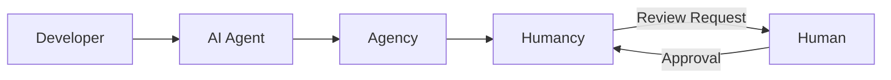

# Level 2: Agency + Humancy

Add human oversight to your agentic workflow with Humancy. This level builds on Agency to include review gates, approvals, and human-in-the-loop processes.

## Overview

Humancy brings humans into the agentic loop by providing:

- **Review Gates** - Pause workflows for human approval
- **Approval Workflows** - Structured review processes
- **Commands** - Human-triggered actions in agent workflows
- **Audit Trail** - Track all human decisions



## Getting Started

### 1. Install Humancy

```bash
npm install -g @generacy-ai/humancy
```

### 2. Initialize Humancy

In your project with Agency already configured:

```bash
humancy init
```

### 3. Add Humancy to MCP

Update your agent configuration:

```json title=".claude/settings.json"
{
  "mcpServers": {
    "agency": {
      "command": "agency",
      "args": ["mcp"]
    },
    "humancy": {
      "command": "humancy",
      "args": ["mcp"]
    }
  }
}
```

## Core Features

### Review Gates

Add review gates to any workflow:

```yaml title=".humancy/workflows/code-review.yml"
name: Code Review
triggers:
  - on: pr_created

steps:
  - id: automated-checks
    tool: agency:code-analysis

  - id: human-review
    type: review-gate
    title: "Review Code Changes"
    reviewers:
      - "@team-leads"
    timeout: 24h
```

### Approval Workflows

Define multi-step approval processes:

```yaml title=".humancy/workflows/deploy.yml"
name: Deployment
triggers:
  - command: "/deploy"

steps:
  - id: build
    tool: agency:build

  - id: test
    tool: agency:test

  - id: staging-approval
    type: review-gate
    title: "Approve Staging Deploy"

  - id: deploy-staging
    tool: generacy:deploy
    env: staging

  - id: production-approval
    type: review-gate
    title: "Approve Production Deploy"
    required_approvals: 2

  - id: deploy-production
    tool: generacy:deploy
    env: production
```

### Commands

Add human commands to your workflow:

| Command | Description |
|---------|-------------|
| `/approve` | Approve the current review gate |
| `/reject` | Reject and provide feedback |
| `/hold` | Pause workflow temporarily |
| `/skip` | Skip optional review gate |

## Configuration

### Basic Configuration

```json title=".humancy/config.json"
{
  "version": "1.0",
  "defaults": {
    "reviewGate": {
      "timeout": "24h",
      "requiredApprovals": 1
    }
  },
  "notifications": {
    "slack": {
      "webhook": "$SLACK_WEBHOOK_URL"
    }
  }
}
```

### Integration with GitHub

```json title=".humancy/config.json"
{
  "integrations": {
    "github": {
      "enabled": true,
      "features": {
        "prReviews": true,
        "issueComments": true,
        "checkRuns": true
      }
    }
  }
}
```

## Best Practices

1. **Start with Critical Paths** - Add review gates to deployment and security-sensitive workflows
2. **Set Reasonable Timeouts** - Balance velocity with oversight
3. **Use Escalation** - Define fallback reviewers for time-sensitive approvals
4. **Audit Regularly** - Review the decision trail to improve workflows

## Use Cases

### Code Review Enhancement

Combine automated analysis with human review:

```
AI Agent: I've completed the implementation. Here's my analysis:
- All tests pass
- No security issues detected
- Code coverage: 87%

Waiting for human review before merge...

[Approve] [Request Changes] [Comment]
```

### Deployment Safety

Ensure humans approve production changes:

```
Deployment to production ready.

Changes:
- 15 files modified
- 3 new features
- 2 bug fixes

Requires 2 approvals from @deployment-team.

Current approvals: 1/2
```

## Troubleshooting

### Review Gates Not Triggering

1. Check workflow YAML syntax
2. Verify trigger conditions
3. Review Humancy logs: `humancy logs`

### Notifications Not Sending

1. Verify webhook configuration
2. Test with: `humancy notify test`
3. Check integration credentials

## Next Steps

- [Generacy Overview](/docs/guides/generacy/overview) - Full local orchestration stack
- [Humancy Configuration](/docs/guides/humancy/configuration) - Advanced options
- [Humancy Plugins](/docs/plugins/humancy-plugins) - Build custom workflows and actions
