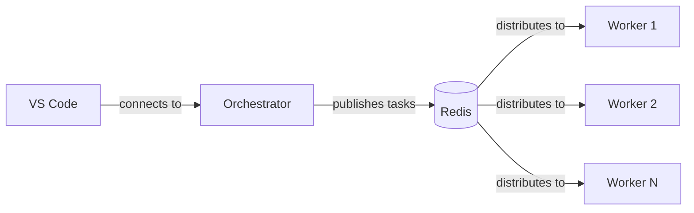

# Multi-Repo Setup

The main getting-started guide walks through a **single-repo** configuration, which is the simplest way to get started. This appendix covers how multi-repo projects differ — when to use them, how the configuration changes, and what additional infrastructure is involved.

:::tip When to use multi-repo
Most teams should start with a single-repo setup and add repositories later. Multi-repo is designed for projects that span multiple services or packages where coordinated changes across repositories are common.
:::

## Single-Repo vs Multi-Repo

Use this table to decide which setup fits your project:

| Criteria | Single-Repo | Multi-Repo |
|----------|-------------|------------|
| **Repository count** | One repository | Two or more repositories |
| **Typical use case** | Monolith, single service, or monorepo | Microservices, polyrepo, shared libraries |
| **Infrastructure** | No additional services needed | Redis + orchestrator + workers (Docker Compose) |
| **Minimum adoption level** | Level 1 | Level 3+ |
| **`generacy init` repos** | Primary only | Primary + dev repos + optional clone repos |
| **Dev container** | Simple `devcontainer.json` | Docker Compose with multiple services |
| **Complexity** | Low | Moderate |

**Choose multi-repo when** your workflows regularly need to coordinate changes across two or more repositories — for example, updating a shared library and its consumers in a single workflow, or making API changes that span a backend and frontend repo.

**Stick with single-repo when** your work is contained within one repository, even if your organization has many repos. You can always add multi-repo support later without re-initializing.

## Differences in `generacy init`

When initializing a multi-repo project, `generacy init` prompts for additional repository information beyond the primary repo:

```bash
generacy init
```

In interactive mode, you'll be prompted for:

1. **Primary repository** — The main repo for the project (same as single-repo)
2. **Development repositories** — Repos cloned for active development where workflows can create PRs
3. **Clone-only repositories** — Repos cloned for reference but where no PRs will be created

You can also specify these via CLI flags:

```bash
generacy init \
  --primary-repo github.com/acme/main-api \
  --dev-repo github.com/acme/shared-lib \
  --dev-repo github.com/acme/worker-service \
  --clone-repo github.com/acme/design-system
```

The `--dev-repo` and `--clone-repo` flags can be repeated to add multiple repositories.

### What Changes

Compared to a single-repo init, multi-repo generates additional files:

| File | Single-Repo | Multi-Repo |
|------|-------------|------------|
| `.generacy/config.yaml` | Primary repo only | Primary + dev + clone repos |
| `.generacy/generacy.env.template` | Base variables | Base + orchestration variables |
| `.devcontainer/devcontainer.json` | Simple container | References Docker Compose |
| `.devcontainer/docker-compose.yml` | Not generated | Redis + orchestrator + worker services |

## Multi-Repo Configuration

A multi-repo `config.yaml` uses the `dev` and `clone` lists under `repos`, and typically includes explicit `orchestrator` settings:

```yaml title=".generacy/config.yaml"
schemaVersion: "1"

project:
  id: "proj_acme789xyz"
  name: "ACME Multi-Repo Project"

repos:
  # Primary repository - where the onboarding PR is created
  primary: "github.com/acme/main-api"

  # Development repositories - cloned for active development
  # Workflows can create PRs in these repos
  dev:
    - "github.com/acme/shared-lib"
    - "github.com/acme/worker-service"
    - "github.com/acme/frontend-app"
    - "github.com/acme/admin-dashboard"
    - "github.com/acme/mobile-api"

  # Clone-only repositories - cloned for reference only
  # No PRs will be created, but code is available for context
  clone:
    - "github.com/acme/design-system"
    - "github.com/acme/documentation"
    - "github.com/acme/infrastructure"

defaults:
  agent: claude-code
  baseBranch: develop

orchestrator:
  pollIntervalMs: 5000
  workerCount: 3
```

### Repository Types

| Type | Purpose | PRs Created? | Example |
|------|---------|-------------|---------|
| **`primary`** | Main repo for the project; onboarding PR lands here | Yes | API gateway, main service |
| **`dev`** | Repos actively worked on as part of this project | Yes | Shared libraries, microservices, frontend apps |
| **`clone`** | Repos cloned for read-only reference | No | Design systems, infrastructure, external API specs |

:::caution No duplicate repos
Each repository can only appear once across `primary`, `dev`, and `clone`. `generacy validate` will flag duplicates as an error.
:::

### Orchestrator Settings

The `orchestrator` block controls how multi-repo workflows are coordinated:

| Setting | Default | Description |
|---------|---------|-------------|
| `pollIntervalMs` | `5000` | How often workers check the task queue for new jobs (minimum 5000ms) |
| `workerCount` | `3` | Maximum number of concurrent workflow executions (range: 1-20) |

Increase `workerCount` if your team runs many parallel workflows. Keep `pollIntervalMs` at the default unless you need lower latency and your Redis instance can handle higher throughput.

## Additional Environment Variables

Multi-repo projects have additional environment variables in `.generacy/generacy.env` for orchestration tuning:

```bash title=".generacy/generacy.env"
# --- Standard variables (same as single-repo) ---
GITHUB_TOKEN=ghp_your_token_here
ANTHROPIC_API_KEY=sk-ant-your_key_here
PROJECT_ID=proj_acme789xyz

# --- Multi-repo orchestration ---

# Redis URL for task queue
# Default points to local Redis instance in dev container
REDIS_URL=redis://redis:6379

# Poll interval for orchestrator task queue (milliseconds)
# How often workers check for new tasks
# POLL_INTERVAL_MS=5000

# Worker timeout for long-running tasks (seconds)
# Adjust if your tasks typically take longer than 30 minutes
# WORKER_TIMEOUT_SECONDS=1800
```

| Variable | Default | Purpose |
|----------|---------|---------|
| `REDIS_URL` | `redis://redis:6379` | Connection string for the Redis task queue |
| `POLL_INTERVAL_MS` | From `config.yaml` | Override the orchestrator poll interval |
| `WORKER_TIMEOUT_SECONDS` | `1800` (30 min) | Maximum time a single task can run before being timed out |

The `POLL_INTERVAL_MS` and `WORKER_TIMEOUT_SECONDS` variables are commented out by default and use values from `config.yaml`. Set them in `generacy.env` only if you need environment-specific overrides.

## Orchestrator Architecture

Multi-repo projects use a local orchestrator backed by Redis to coordinate work across repositories:



- **Orchestrator** — The main dev container. Receives workflow requests, breaks them into tasks, and publishes them to the Redis queue.
- **Redis** — A lightweight message queue (Redis 7 Alpine) that coordinates work between the orchestrator and workers.
- **Workers** — Parallel execution containers that pull tasks from the queue. Each worker has access to all project repositories.

All services are defined in `.devcontainer/docker-compose.yml` and start automatically when you open the dev container in VS Code. See [Dev Environment](./dev-environment.md) for details on starting and verifying the services.

## Migrating from Single-Repo to Multi-Repo

To add multi-repo support to an existing single-repo project:

1. **Add repositories to `config.yaml`** — Add `dev` and/or `clone` lists under `repos`:

   ```yaml title=".generacy/config.yaml"
   repos:
     primary: "github.com/acme/main-api"
     dev:
       - "github.com/acme/shared-lib"
     clone:
       - "github.com/acme/design-system"
   ```

2. **Add orchestrator settings** — Add the `orchestrator` block:

   ```yaml title=".generacy/config.yaml"
   orchestrator:
     pollIntervalMs: 5000
     workerCount: 3
   ```

3. **Re-run `generacy init`** — This generates the Docker Compose files and updates your env template:

   ```bash
   generacy init
   ```

   The command detects existing files and prompts before overwriting. Your `config.yaml` and `generacy.env` are preserved.

4. **Update your env file** — Copy any new variables from the updated template:

   ```bash
   cp .generacy/generacy.env.template .generacy/generacy.env.new
   # Merge new variables into your existing generacy.env
   ```

5. **Validate** — Run `generacy validate` to confirm the configuration is valid, then `generacy doctor` to check that Docker and Redis are available.

## Next Steps

- [Dev Environment](./dev-environment.md) — How the Docker Compose services work and how to connect
- [Configuration](./configuration.md) — Full config.yaml reference
- [Verify Setup](./verify-setup.md) — Validate your multi-repo setup
- [Adoption Levels](./adoption-levels.md) — Multi-repo requires Level 3+; see what each level provides
