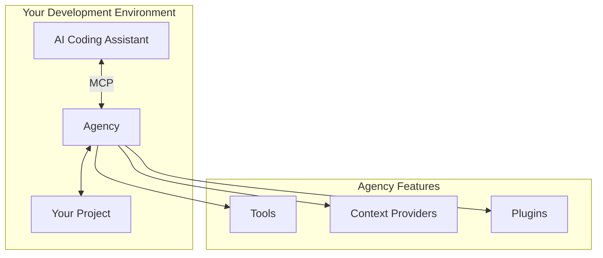
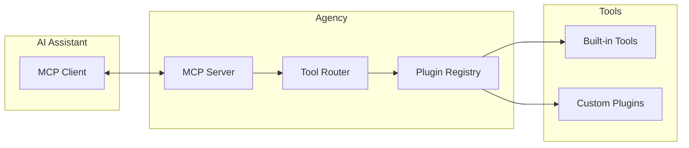

# Agency Overview

Agency is the local agent enhancement layer of the Generacy ecosystem. It provides tools, context, and plugins to extend your AI coding assistant's capabilities.

## What is Agency?

Agency acts as a bridge between your AI coding assistant and your development environment. It provides:

- **MCP Tools** - Model Context Protocol tools that extend agent capabilities
- **Context Providers** - Automatic context about your project
- **Plugin System** - Extensible architecture for custom functionality
- **Local-first** - Everything runs locally, no cloud required



## Key Features

### MCP Integration

Agency implements the [Model Context Protocol (MCP)](https://modelcontextprotocol.io/), enabling seamless integration with AI assistants that support it:

- Claude Code
- Cursor
- Continue
- And more

### Built-in Tools

Agency provides several built-in tools:

| Tool | Description |
|------|-------------|
| `project-info` | Project metadata, dependencies, and structure |
| `file-search` | Enhanced search across project files |
| `code-analysis` | Analyze patterns, dependencies, and quality |
| `git-context` | Recent changes, branches, and history |

### Context Providers

Automatic context injection:

- **Project Context** - Package.json, configuration files, structure
- **Git Context** - Current branch, recent commits, uncommitted changes
- **Environment Context** - Node version, OS, available tools
- **Custom Context** - Define project-specific context

### Plugin System

Extend Agency with plugins:

```bash
# Install a plugin
agency plugin install @generacy/plugin-jest

# List installed plugins
agency plugin list

# Create a custom plugin
agency plugin create my-tool
```

## Architecture



## Use Cases

### Enhanced Code Understanding

```
Developer: Explain the authentication flow in this project

Agent (with Agency): Based on the project analysis:
- Authentication is handled in src/auth/
- Uses JWT tokens with refresh flow
- Integrates with OAuth providers
[Shows relevant files and diagrams]
```

### Project-Aware Assistance

```
Developer: Add a new API endpoint for user profiles

Agent (with Agency): I'll add the endpoint following your project patterns:
- Router: src/routes/users.ts (matching existing patterns)
- Controller: src/controllers/userController.ts
- Service: src/services/userService.ts
- Tests: src/tests/users.test.ts
```

### Automated Tasks

```
Developer: Run the test suite and fix any failures

Agent (with Agency): Running tests via Agency...
[Tests run]
Found 2 failures. Analyzing and fixing...
[Fixes applied]
All tests passing.
```

## Getting Started

Ready to use Agency? Check out:

- [Installation Guide](/docs/getting-started/installation)
- [Level 1: Agency Only](/docs/getting-started/level-1-agency-only)
- [Agency Configuration](/docs/guides/agency/configuration)
