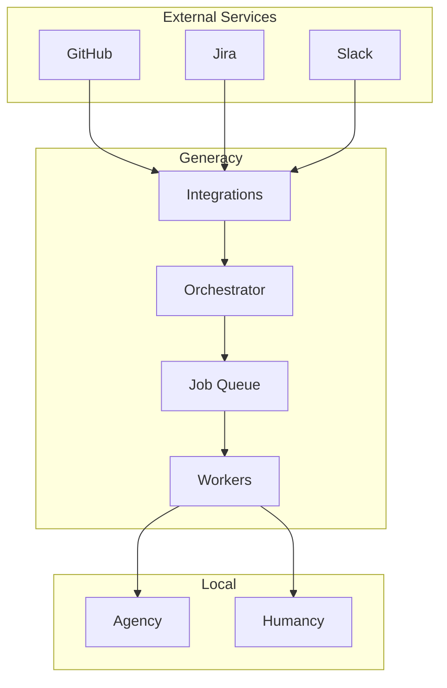
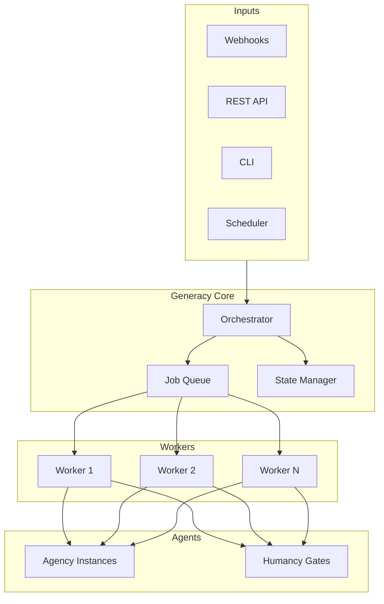
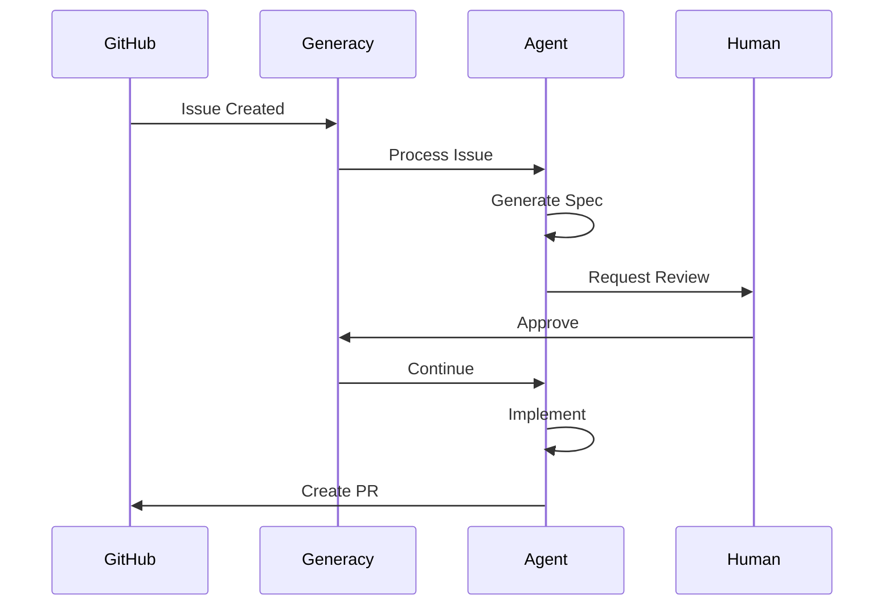

# Generacy Overview

Generacy is the orchestration layer that coordinates agents at scale. It manages workflows, queues tasks, and integrates with external services.

## What is Generacy?

Generacy brings together Agency and Humancy to provide:

- **Workflow Orchestration** - Coordinate complex multi-step workflows
- **Job Queue** - Schedule and manage background tasks
- **Integration Hub** - Connect to GitHub, Jira, and more
- **Multi-Agent Coordination** - Run multiple agents in parallel



## Key Features

### Workflow Orchestration

Define and execute complex workflows:

```yaml
name: Feature Development
triggers:
  - on: issue_assigned
    labels: ["feature"]

stages:
  - name: specification
    steps:
      - action: speckit:specify
      - action: speckit:clarify
        gate: clarification-review

  - name: planning
    steps:
      - action: speckit:plan
        gate: plan-review
      - action: speckit:tasks

  - name: implementation
    steps:
      - action: speckit:implement
        gate: code-review
```

### Job Queue

Schedule and manage background jobs:

```typescript
// Queue a job
await generacy.queue.add('process-issue', {
  issueUrl: 'https://github.com/org/repo/issues/123',
  priority: 'high',
});

// Job runs in worker
generacy.worker.process('process-issue', async (job) => {
  const { issueUrl } = job.data;
  // Process the issue...
});
```

### Integration Hub

Connect to external services:

| Integration | Features |
|-------------|----------|
| **GitHub** | Issues, PRs, Actions, Webhooks |
| **Jira** | Issues, Projects, Webhooks |
| **Slack** | Notifications, Commands |
| **Linear** | Issues, Projects |
| **Custom** | Webhook and API support |

### Multi-Agent Coordination

Run multiple agents in parallel:

```yaml
stages:
  - name: parallel-implementation
    parallel:
      - agent: agency-1
        task: implement-frontend
      - agent: agency-2
        task: implement-backend
      - agent: agency-3
        task: implement-tests
    join: all  # Wait for all agents
```

## Architecture



## Deployment Options

### Local Development (Level 3)

Run everything locally:

```bash
# Start Generacy locally
generacy start --local

# Or with Docker Compose
docker-compose up
```

### Cloud Deployment (Level 4)

Deploy for team use:

```bash
# Deploy to cloud
generacy deploy --env production

# Or use managed service
# Visit https://generacy.ai for hosted option
```

## Use Cases

### Automated Issue Processing



### CI/CD Integration

```yaml
name: Deployment Pipeline
triggers:
  - on: push
    branches: [main]

stages:
  - name: build
    steps:
      - action: build
      - action: test
      - action: security-scan

  - name: deploy-staging
    steps:
      - action: deploy
        env: staging
      - gate: staging-verification

  - name: deploy-production
    steps:
      - gate: production-approval
        approvers: 2
      - action: deploy
        env: production
```

### Multi-Repository Coordination

```yaml
name: Monorepo Release
triggers:
  - command: "/release"

stages:
  - name: prepare
    parallel:
      - repo: frontend
        action: prepare-release
      - repo: backend
        action: prepare-release
      - repo: shared
        action: prepare-release

  - name: release
    gate: release-approval
    steps:
      - action: publish-all
```

## Getting Started

1. [Installation Guide](/docs/getting-started/installation)
2. [Generacy Configuration](/docs/guides/generacy/configuration)
3. [API Reference](/docs/reference/api)
