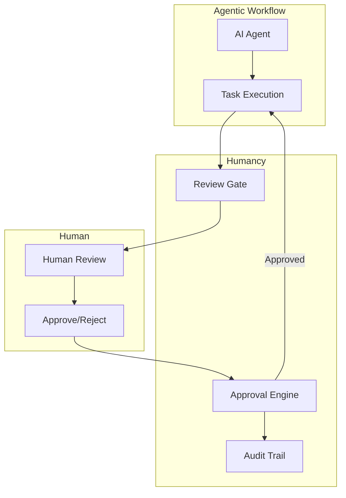
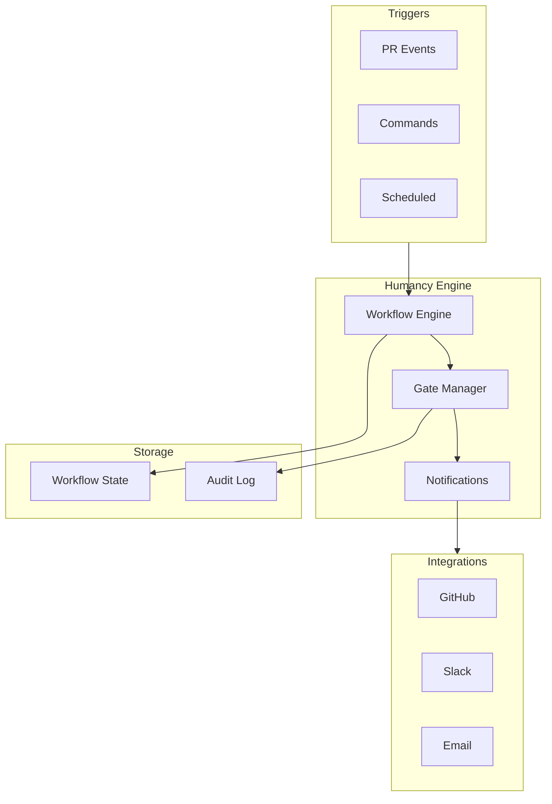

# Humancy Overview

Humancy brings humans into the agentic loop. It provides review gates, approval workflows, and audit trails to ensure human oversight of AI-assisted development.

## What is Humancy?

Humancy is the human oversight layer of the Generacy ecosystem. It enables:

- **Review Gates** - Pause automated workflows for human approval
- **Approval Workflows** - Define multi-step approval processes
- **Commands** - Human-triggered actions in agent workflows
- **Audit Trail** - Complete record of all human decisions



## Key Features

### Review Gates

Review gates pause automated workflows for human review:

```yaml
- id: code-review
  type: review-gate
  title: "Review Code Changes"
  description: "Verify implementation meets requirements"
  reviewers:
    - "@team-leads"
```

Gate types:
- **Blocking** - Workflow pauses until approved
- **Non-blocking** - Workflow continues, review happens async
- **Time-bounded** - Auto-approves after timeout

### Approval Workflows

Define complex approval processes:

```yaml
name: Production Deployment
steps:
  - id: staging-deploy
    type: action
    action: deploy-staging

  - id: qa-approval
    type: review-gate
    reviewers: ["@qa-team"]

  - id: prod-approval
    type: review-gate
    required_approvals: 2
    reviewers: ["@engineering-leads", "@security"]

  - id: prod-deploy
    type: action
    action: deploy-production
```

### Commands

Human-triggered commands in workflows:

| Command | Description |
|---------|-------------|
| `/approve` | Approve current review gate |
| `/reject [reason]` | Reject with feedback |
| `/hold` | Pause workflow |
| `/resume` | Resume held workflow |
| `/skip` | Skip optional gate |
| `/escalate` | Escalate to senior reviewer |

### Audit Trail

Every human decision is recorded:

```json
{
  "timestamp": "2024-01-15T10:30:00Z",
  "gate": "prod-approval",
  "action": "approve",
  "reviewer": "jane@company.com",
  "comment": "LGTM, verified in staging",
  "context": {
    "pr": "#123",
    "commit": "abc1234"
  }
}
```

## Architecture



## Use Cases

### Code Review Automation

Combine automated checks with human review:

```yaml
name: Code Review
triggers:
  - on: pull_request

steps:
  - id: lint
    type: action
    action: run-linter

  - id: test
    type: action
    action: run-tests

  - id: security-scan
    type: action
    action: security-scan

  - id: human-review
    type: review-gate
    title: "Human Code Review"
    requires:
      - lint
      - test
      - security-scan
```

### Deployment Approvals

Ensure humans approve production changes:

```yaml
name: Deploy
triggers:
  - command: "/deploy"

steps:
  - id: build
    type: action
    action: build

  - id: deploy-staging
    type: action
    action: deploy
    env: staging

  - id: staging-approval
    type: review-gate
    title: "Verify Staging"
    timeout: 4h

  - id: deploy-production
    type: action
    action: deploy
    env: production
```

### Sensitive Operations

Gate sensitive operations:

```yaml
name: Database Migration
triggers:
  - command: "/migrate"

steps:
  - id: backup
    type: action
    action: backup-database

  - id: migration-approval
    type: review-gate
    title: "Approve Migration"
    required_approvals: 2
    reviewers: ["@dba-team", "@engineering-leads"]

  - id: migrate
    type: action
    action: run-migration
```

## Getting Started

1. [Install Humancy](/docs/getting-started/installation)
2. [Level 2 Guide](/docs/getting-started/level-2-agency-humancy)
3. [Humancy Configuration](/docs/guides/humancy/configuration)
