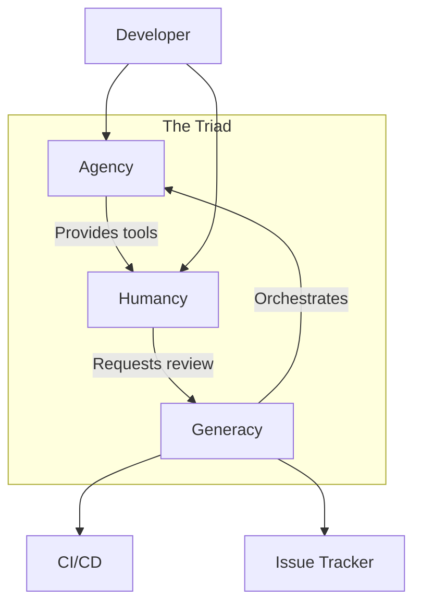

# Introduction to Generacy

Welcome to the Generacy documentation. Generacy is an agentic development platform that helps you build more with AI agents while keeping humans in the loop.

## The Triad

Generacy consists of three core components that work together:

### Agency

**Agency** is the local agent enhancement layer. It provides tools and context to AI coding assistants like Claude Code, Cursor, and GitHub Copilot.

- Extends agent capabilities with custom tools
- Provides project-aware context
- Works entirely locally

### Humancy

**Humancy** brings humans into the agentic loop. It provides commands and workflows that require human approval or review.

- Adds review gates to workflows
- Manages approval processes
- Integrates with existing tools

### Generacy

**Generacy** is the orchestration layer that coordinates agents at scale. It manages workflows, queues tasks, and integrates with external services.

- Orchestrates multi-agent workflows
- Manages job queues and scheduling
- Integrates with GitHub, Jira, and more

## Progressive Adoption

You can adopt Generacy progressively, starting with just the components you need:

| Level | Components | Description |
|-------|------------|-------------|
| **Level 1** | Agency | Local agent enhancement only |
| **Level 2** | Agency + Humancy | Add human oversight |
| **Level 3** | Full Local | Complete local stack |
| **Level 4** | Cloud | Team/enterprise deployment |

## Getting Started

Ready to begin? Check out the [Getting Started Guide](/docs/getting-started) to get up and running in under 30 minutes.

Or explore the component guides:

- [Agency Guide](/docs/guides/agency/overview)
- [Humancy Guide](/docs/guides/humancy/overview)
- [Generacy Guide](/docs/guides/generacy/overview)
