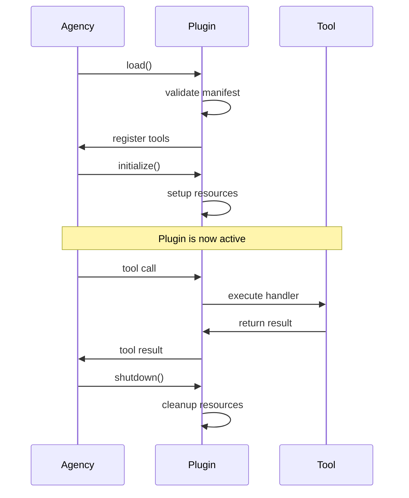

# Developing Plugins

Plugins extend the Generacy ecosystem with custom tools, integrations, and workflows. This guide covers the fundamentals of plugin development.

## Plugin Types

Generacy supports three types of plugins:

| Type | Component | Purpose |
|------|-----------|---------|
| **Agency Plugin** | Agency | Add MCP tools for agent enhancement |
| **Humancy Plugin** | Humancy | Add review gates and workflow steps |
| **Generacy Plugin** | Generacy | Add integrations and job processors |

## Plugin Structure

All plugins follow a common structure:

```
my-plugin/
├── package.json          # Plugin metadata
├── manifest.json         # Plugin manifest
├── src/
│   ├── index.ts          # Plugin entry point
│   └── tools/            # Tool implementations
└── README.md
```

### package.json

```json title="package.json"
{
  "name": "@my-org/generacy-plugin-example",
  "version": "1.0.0",
  "main": "dist/index.js",
  "types": "dist/index.d.ts",
  "keywords": ["generacy-plugin", "agency-plugin"],
  "peerDependencies": {
    "@generacy-ai/agency": "^1.0.0"
  }
}
```

### manifest.json

```json title="manifest.json"
{
  "name": "example-plugin",
  "version": "1.0.0",
  "type": "agency",
  "description": "An example Agency plugin",
  "tools": [
    {
      "name": "example-tool",
      "description": "An example tool",
      "schema": {
        "type": "object",
        "properties": {
          "input": {
            "type": "string",
            "description": "Input value"
          }
        },
        "required": ["input"]
      }
    }
  ]
}
```

## Creating a Plugin

### 1. Initialize the Project

```bash
# Create project directory
mkdir my-agency-plugin
cd my-agency-plugin

# Initialize npm project
npm init -y

# Install dependencies
npm install @generacy-ai/agency --save-peer
npm install typescript @types/node --save-dev
```

### 2. Create the Manifest

```json title="manifest.json"
{
  "name": "my-plugin",
  "version": "1.0.0",
  "type": "agency",
  "description": "My custom Agency plugin",
  "tools": [
    {
      "name": "my-tool",
      "description": "Performs a custom action",
      "schema": {
        "type": "object",
        "properties": {
          "action": {
            "type": "string",
            "description": "The action to perform"
          }
        },
        "required": ["action"]
      }
    }
  ]
}
```

### 3. Implement the Plugin

```typescript title="src/index.ts"
import { Plugin, Tool, ToolResult } from '@generacy-ai/agency';

export default class MyPlugin implements Plugin {
  name = 'my-plugin';
  version = '1.0.0';

  tools: Tool[] = [
    {
      name: 'my-tool',
      description: 'Performs a custom action',
      handler: this.myToolHandler.bind(this),
    },
  ];

  async initialize(): Promise<void> {
    // Setup code here
  }

  async myToolHandler(params: { action: string }): Promise<ToolResult> {
    const { action } = params;

    // Implement your tool logic
    const result = await this.performAction(action);

    return {
      success: true,
      data: result,
    };
  }

  private async performAction(action: string): Promise<string> {
    // Your implementation
    return `Performed: ${action}`;
  }
}
```

### 4. Build and Test

```bash
# Build
npm run build

# Test locally
agency plugin test ./dist
```

## Plugin Lifecycle



## Best Practices

### 1. Validate Input

Always validate tool input:

```typescript
async myToolHandler(params: unknown): Promise<ToolResult> {
  // Validate params
  if (!isValidParams(params)) {
    return {
      success: false,
      error: 'Invalid parameters',
    };
  }

  // Process...
}
```

### 2. Handle Errors Gracefully

```typescript
async myToolHandler(params: Params): Promise<ToolResult> {
  try {
    const result = await this.riskyOperation();
    return { success: true, data: result };
  } catch (error) {
    return {
      success: false,
      error: error instanceof Error ? error.message : 'Unknown error',
    };
  }
}
```

### 3. Use Async/Await

All tool handlers should be async:

```typescript
async myToolHandler(params: Params): Promise<ToolResult> {
  const data = await fetchData();
  const processed = await processData(data);
  return { success: true, data: processed };
}
```

### 4. Document Your Tools

Provide clear descriptions:

```json
{
  "name": "database-query",
  "description": "Execute a read-only SQL query against the project database. Returns results as JSON array.",
  "schema": {
    "type": "object",
    "properties": {
      "query": {
        "type": "string",
        "description": "SQL query to execute (SELECT only)"
      },
      "limit": {
        "type": "number",
        "description": "Maximum rows to return (default: 100)",
        "default": 100
      }
    }
  }
}
```

## Publishing

### To npm

```bash
# Build
npm run build

# Publish
npm publish --access public
```

### To Plugin Registry

```bash
# Register with Generacy
generacy plugin publish
```

## Next Steps

- [Agency Plugins](/docs/plugins/agency-plugins) - Agency-specific plugin development
- [Humancy Plugins](/docs/plugins/humancy-plugins) - Humancy-specific plugin development
- [Generacy Plugins](/docs/plugins/generacy-plugins) - Generacy-specific plugin development
- [Manifest Reference](/docs/plugins/manifest-reference) - Complete manifest documentation
