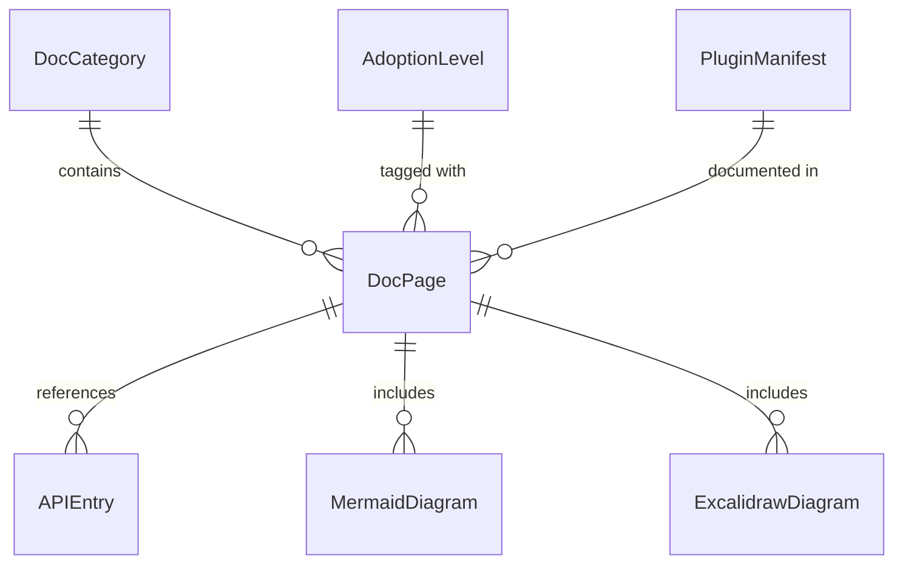

# Data Model: Documentation site and developer guides

## Core Entities

### Documentation Page

```typescript
interface DocPage {
  id: string;                    // URL slug (e.g., "getting-started/quick-start")
  title: string;                 // Page title
  description?: string;          // Meta description for SEO
  sidebar_position?: number;     // Position in sidebar navigation
  tags?: string[];               // Searchable tags
  draft?: boolean;               // Hide from production
}
```

### Category

```typescript
interface DocCategory {
  label: string;                 // Display label
  position: number;              // Position in sidebar
  link?: {
    type: 'generated-index' | 'doc';
    slug?: string;               // Custom slug
  };
  collapsed?: boolean;           // Default collapsed state
}
```

### Adoption Level

```typescript
enum AdoptionLevel {
  Level1_AgencyOnly = 1,
  Level2_AgencyHumancy = 2,
  Level3_LocalOrchestration = 3,
  Level4_Cloud = 4
}

interface AdoptionLevelMeta {
  level: AdoptionLevel;
  title: string;
  description: string;
  components: ('agency' | 'humancy' | 'generacy')[];
  prerequisites: string[];
  setupTime: string;             // e.g., "5 minutes"
}
```

## Configuration Schemas

### Docusaurus Config

```typescript
interface DocusaurusConfig {
  title: string;                 // "Generacy Documentation"
  tagline: string;               // Site tagline
  url: string;                   // "https://generacy-ai.github.io"
  baseUrl: string;               // "/generacy/"
  organizationName: string;      // "generacy-ai"
  projectName: string;           // "generacy"

  themeConfig: {
    navbar: NavbarConfig;
    footer: FooterConfig;
    colorMode: ColorModeConfig;
    docs: DocsConfig;
  };

  presets: PresetConfig[];
  plugins: PluginConfig[];
}
```

### API Reference Entry

```typescript
interface APIEntry {
  name: string;                  // Function/class name
  signature: string;             // Type signature
  description: string;           // JSDoc description
  parameters?: ParameterDoc[];
  returns?: ReturnDoc;
  examples?: string[];
  since?: string;                // Version introduced
  deprecated?: string;           // Deprecation notice
}

interface ParameterDoc {
  name: string;
  type: string;
  description: string;
  optional?: boolean;
  default?: string;
}

interface ReturnDoc {
  type: string;
  description: string;
}
```

## Diagram Types

### Mermaid Diagram

```typescript
interface MermaidDiagram {
  type: 'flowchart' | 'sequenceDiagram' | 'classDiagram' | 'stateDiagram' | 'erDiagram';
  code: string;                  // Mermaid DSL code
  title?: string;
  caption?: string;
}
```

### Excalidraw Diagram

```typescript
interface ExcalidrawDiagram {
  source: string;                // Path to .excalidraw file
  export: {
    format: 'png' | 'svg';
    path: string;                // Export path in static/
    width?: number;
    height?: number;
  };
  alt: string;                   // Accessibility text
  caption?: string;
}
```

## Plugin Documentation

### Plugin Manifest

```typescript
interface PluginManifest {
  name: string;                  // Plugin identifier
  version: string;               // Semver version
  description: string;
  author?: string;
  license?: string;

  target: 'agency' | 'humancy' | 'generacy';

  entryPoint: string;            // Main module path

  dependencies?: {
    [packageName: string]: string;
  };

  config?: {
    schema: JSONSchema;          // Config validation schema
    defaults?: Record<string, unknown>;
  };

  hooks?: {
    [hookName: string]: HookDefinition;
  };

  tools?: ToolDefinition[];      // For Agency plugins
  commands?: CommandDefinition[]; // For Humancy plugins
}
```

## Validation Rules

### Documentation Page Validation

1. **ID Format**: Lowercase, alphanumeric with hyphens, no spaces
2. **Title Length**: 5-100 characters
3. **Description Length**: 50-160 characters (SEO optimal)
4. **Required Fields**: `id`, `title`
5. **Unique IDs**: No duplicate page IDs within the docs

### API Entry Validation

1. **Name Required**: Non-empty string
2. **Signature Format**: Valid TypeScript type annotation
3. **Description Required**: Non-empty for public APIs
4. **Example Required**: At least one example for public functions

## Relationships



---

*Generated by speckit*
