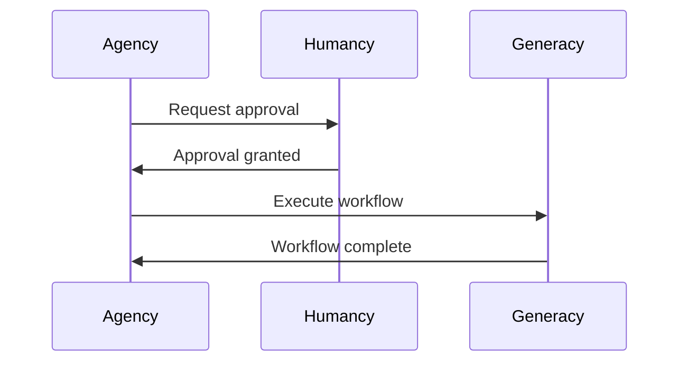

# Quickstart: Documentation site and developer guides

## Installation

### Prerequisites

- Node.js 20 or higher
- npm 10 or higher
- Git

### Setup Documentation Site

```bash
# Navigate to the docs directory
cd docs

# Install dependencies
npm install

# Start development server
npm run start
```

The documentation site will be available at `http://localhost:3000`.

## Usage Examples

### Local Development

```bash
# Start with hot reload
npm run start

# Build static site
npm run build

# Preview production build
npm run serve

# Check for broken links
npm run build -- --strict
```

### Generate API Documentation

```bash
# Generate TypeDoc API reference
npm run typedoc

# This outputs to docs/api/ directory
```

### Writing Documentation

Create a new page in the appropriate directory:

```markdown
---
id: my-new-page
title: My New Page
sidebar_position: 1
tags: [getting-started, tutorial]
---

# My New Page

Content goes here...
```

### Adding Mermaid Diagrams

Use Mermaid code blocks for technical diagrams:

````markdown

````

### Adding Excalidraw Diagrams

1. Create diagram in Excalidraw
2. Export as PNG to `static/img/diagrams/`
3. Reference in markdown:

```markdown

```

## Available Commands

| Command | Description |
|---------|-------------|
| `npm run start` | Start development server with hot reload |
| `npm run build` | Build static production site |
| `npm run serve` | Preview production build locally |
| `npm run typedoc` | Generate TypeDoc API reference |
| `npm run clear` | Clear Docusaurus cache |
| `npm run deploy` | Deploy to GitHub Pages |

## Deployment

### Automatic Deployment

Push to `main` branch triggers GitHub Actions workflow that:
1. Builds the documentation site
2. Deploys to GitHub Pages

### Manual Deployment

```bash
# Build and deploy manually
npm run build
npm run deploy
```

## Troubleshooting

### Common Issues

**Build fails with "module not found"**
```bash
# Clear cache and reinstall
npm run clear
rm -rf node_modules
npm install
```

**TypeDoc not generating output**
```bash
# Verify TypeScript source has JSDoc comments
# Check typedoc.json configuration
npm run typedoc -- --logLevel Verbose
```

**Mermaid diagrams not rendering**
```bash
# Verify @docusaurus/theme-mermaid is installed
npm ls @docusaurus/theme-mermaid
```

**GitHub Pages 404**
- Verify `baseUrl` in `docusaurus.config.ts` matches repository name
- Check that `gh-pages` branch exists and is configured as Pages source

### Getting Help

- Check [Docusaurus Documentation](https://docusaurus.io/docs)
- Open an issue in the Generacy repository
- Review GitHub Actions logs for deployment failures

---

*Generated by speckit*
