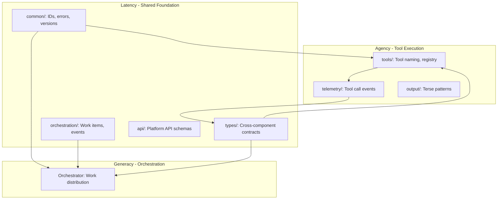

# Implementation Plan: Migrate Contracts Types to Latency

**Feature**: 246-1-9-migrate-contracts
**Date**: 2026-02-24
**Status**: Ready for Implementation

## Executive Summary

This plan outlines the migration of the `@generacy-ai/contracts` package to its proper destinations: `@generacy-ai/latency` for shared cross-component types and `@generacy-ai/agency` for tool-specific schemas. The migration is straightforward because **no active repository currently depends on contracts** (only the deferred `humancy/extension` has a `file:` dependency). This eliminates the complexity of coordinated releases and breaking change management.

**Key Findings**:
- 209 TypeScript files (~1,152 exports) to migrate
- Zero active dependencies (humancy is deferred)
- Well-organized source structure maps cleanly to destinations
- Existing test coverage travels with migrated types
- Fast migration timeline: 1-2 weeks

## Technical Context

### Technology Stack
- **Language**: TypeScript 5.7+
- **Runtime**: Node.js >=20.0.0
- **Package Manager**: pnpm (workspace monorepo)
- **Validation**: Zod 3.23+
- **Testing**: Vitest 3.2+
- **Build**: TypeScript compiler (tsc), tsup for contracts

### Repository Structure
```
/workspaces/
├── contracts/              # Source to migrate (209 TS files)
│   └── src/
│       ├── agency-generacy/      # → latency (cross-component)
│       ├── agency-humancy/       # → latency (cross-component)
│       ├── generacy-humancy/     # → latency (cross-component)
│       ├── common/               # → latency (shared foundation)
│       ├── orchestration/        # → latency (orchestration types)
│       ├── telemetry/            # → agency (tool telemetry)
│       ├── schemas/              # → agency (tool schemas)
│       ├── version-compatibility/# → latency (versioning)
│       └── generated/            # → agency (schema generation)
│
├── latency/                # Destination for shared types
│   └── packages/latency/
│       └── src/
│           ├── facets/           # Existing plugin interfaces
│           ├── composition/      # Plugin composition
│           └── runtime/          # Facet registry runtime
│
├── agency/                 # Destination for tool schemas
│   └── packages/agency/
│       └── src/
│           ├── tools/            # Tool registry and validation
│           ├── telemetry/        # Tool call interception
│           └── output/           # Terse output patterns
│
└── humancy/extension/      # Only consumer (deferred, inactive)
```

### Dependencies to Migrate
From `@generacy-ai/contracts/package.json`:
```json
{
  "dependencies": {
    "ulid": "^3.0.2",           // ID generation
    "zod": "^3.23.8",           // Runtime validation
    "zod-to-json-schema": "^3.23.5"  // JSON Schema export
  }
}
```

**Destination**:
- `ulid` → latency (for shared ID generation)
- `zod` → both latency and agency (already present)
- `zod-to-json-schema` → agency (for tool schema export)

## Architecture Overview

### Migration Strategy: Domain-Organized Distribution

The contracts package was organized by **cross-component domain** (e.g., `agency-generacy/`, `common/`, `orchestration/`). This structure directly informs the migration destinations:

```
contracts/src/               Destination        Rationale
─────────────────────────────────────────────────────────────────────
agency-generacy/          → latency/types/     Cross-component contract
agency-humancy/           → latency/types/     Cross-component contract
generacy-humancy/         → latency/types/     Cross-component contract
common/                   → latency/common/    Shared foundation (IDs, errors, versions)
orchestration/            → latency/orchestration/  Work items, agent info, events
version-compatibility/    → latency/versioning/     Capability registry, schema versioning
telemetry/                → agency/telemetry/  Tool call events and metrics
schemas/tool-naming/      → agency/tools/      Tool naming conventions
schemas/tool-result/      → agency/output/     Terse output patterns
schemas/platform-api/     → latency/api/       Platform API contracts
schemas/decision-model/   → latency/types/     Decision schemas (cross-component)
schemas/extension-comms/  → latency/types/     Extension communication
schemas/knowledge-store/  → latency/types/     Knowledge store schemas
schemas/learning-loop/    → latency/types/     Learning loop schemas
schemas/attribution-metrics/ → latency/types/  Attribution tracking
schemas/data-export/      → latency/types/     Data export schemas
schemas/github-app/       → latency/types/     GitHub app webhooks
generated/                → agency/schemas/    Generated tool schemas
```

### New Directory Structure

#### Latency Package
```
latency/packages/latency/src/
├── common/                 # From contracts/common/
│   ├── ids.ts             # ULID-based ID generation
│   ├── timestamps.ts      # ISO timestamp utilities
│   ├── pagination.ts      # Pagination params
│   ├── errors.ts          # ErrorCode, ErrorResponse
│   ├── version.ts         # SemVer parsing and comparison
│   ├── capability.ts      # Capability system
│   └── message-envelope.ts # Cross-component messaging
├── orchestration/         # From contracts/orchestration/
│   ├── work-item.ts       # Work item schemas
│   ├── agent-info.ts      # Agent metadata
│   ├── events.ts          # Orchestration events
│   └── status.ts          # Status enums
├── versioning/            # From contracts/version-compatibility/
│   ├── capability-registry.ts
│   ├── versioned-schemas.ts
│   └── deprecation-warnings.ts
├── types/                 # Cross-component schemas
│   ├── agency-generacy/   # Agent-orchestrator contracts
│   ├── agency-humancy/    # Agent-human contracts
│   ├── generacy-humancy/  # Orchestrator-human contracts
│   ├── decision-model/    # Decision schemas
│   ├── extension-comms/   # Extension communication
│   ├── knowledge-store/   # Knowledge schemas
│   ├── learning-loop/     # Learning loop schemas
│   ├── attribution-metrics/ # Attribution tracking
│   ├── data-export/       # Data export schemas
│   └── github-app/        # GitHub app schemas
└── api/                   # From contracts/schemas/platform-api/
    ├── auth/
    ├── organization/
    └── subscription/
```

#### Agency Package
```
agency/packages/agency/src/
├── tools/                 # Enhanced with contracts/schemas/tool-naming/
│   ├── naming/            # NEW: Tool naming conventions
│   │   ├── schemas.ts     # ToolNameSchema, ToolPrefixSchema
│   │   ├── parser.ts      # parseToolName, validateToolName
│   │   └── constants.ts   # ToolPrefixValues
│   ├── registry.ts        # Existing tool registry
│   └── validation.ts      # Existing tool validation
├── telemetry/             # Enhanced with contracts/telemetry/
│   ├── events/            # NEW: From contracts/telemetry/
│   │   ├── tool-call-event.ts
│   │   ├── tool-stats.ts
│   │   ├── error-category.ts
│   │   ├── time-window.ts
│   │   └── anonymous-tool-metric.ts
│   └── interceptor.ts     # Existing tool call interceptor
├── output/                # Enhanced with contracts/schemas/tool-result/
│   ├── terse/             # Existing terse output
│   └── schemas.ts         # NEW: TerseToolResultSchema (from contracts)
└── schemas/               # NEW: From contracts/generated/
    └── tool-result.schema.json
```

### Data Flow After Migration



## Implementation Phases

### Phase 1: Audit and Categorization (2 days)

**Objective**: Create a complete inventory of all types in contracts and their destinations.

**Tasks**:

1. **Generate Export Inventory**
   ```bash
   # Count all exported types
   cd /workspaces/contracts
   rg "^export" src/ --type ts | wc -l  # Expected: ~1152

   # Categorize by directory
   for dir in src/*/; do
     echo "$dir: $(rg '^export' $dir --type ts | wc -l)"
   done
   ```

2. **Create Migration Manifest** (`migration-manifest.json`)
   ```json
   {
     "version": "1.0.0",
     "timestamp": "2026-02-24T00:00:00Z",
     "sources": [
       {
         "path": "contracts/src/common",
         "destination": "latency/packages/latency/src/common",
         "fileCount": 15,
         "exportCount": 88,
         "testCount": 12,
         "dependencies": ["ulid", "zod"]
       },
       {
         "path": "contracts/src/orchestration",
         "destination": "latency/packages/latency/src/orchestration",
         "fileCount": 8,
         "exportCount": 45,
         "testCount": 8,
         "dependencies": ["zod"]
       }
       // ... rest of mappings
     ]
   }
   ```

3. **Verify Zero Active Dependencies**
   ```bash
   # Search all repos for contracts imports
   for repo in latency agency generacy generacy-cloud; do
     echo "=== $repo ==="
     rg "@generacy-ai/contracts" /workspaces/$repo/src/ 2>/dev/null || echo "✓ None"
   done

   # Verify humancy dependency (should only be file: reference)
   rg "@generacy-ai/contracts" /workspaces/humancy/ || echo "Only file: dependency"
   ```

4. **Document Test Coverage**
   - Run contracts test suite: `cd /workspaces/contracts && pnpm test`
   - Document test-to-source ratio per module
   - Identify any tests that depend on cross-module interactions

**Deliverables**:
- ✅ `migration-manifest.json` - Complete source-to-destination mapping
- ✅ `audit-report.md` - Export counts, dependencies, test coverage
- ✅ Verified zero active dependencies

### Phase 2: Prepare Destination Repositories (2 days)

**Objective**: Set up directory structures and update configurations in latency and agency.

**Tasks**:

1. **Latency Structure Setup**
   ```bash
   cd /workspaces/latency/packages/latency/src

   # Create new directories
   mkdir -p common orchestration versioning types/{agency-generacy,agency-humancy,generacy-humancy,decision-model,extension-comms,knowledge-store,learning-loop,attribution-metrics,data-export,github-app} api/{auth,organization,subscription}

   # Add README.md to each with purpose statement
   ```

2. **Agency Structure Setup**
   ```bash
   cd /workspaces/agency/packages/agency/src

   # Create new directories
   mkdir -p tools/naming telemetry/events output/schemas schemas

   # Add README.md to each
   ```

3. **Update Latency package.json**
   ```json
   {
     "dependencies": {
       "ulid": "^3.0.2",    // ADD: for ID generation
       "zod": "^3.23.8"     // Already present, verify version
     }
   }
   ```

4. **Update Agency package.json**
   ```json
   {
     "dependencies": {
       "zod": "^3.24.1",              // Already present
       "zod-to-json-schema": "^3.23.5" // ADD: for schema export
     }
   }
   ```

5. **Update TypeScript Configurations**
   - Verify `tsconfig.json` includes new directories
   - Update path aliases if needed

**Deliverables**:
- ✅ Directory structures created
- ✅ Dependencies added to package.json files
- ✅ READMEs documenting new module purposes
- ✅ Updated tsconfig.json files

### Phase 3: Migrate Shared Foundation to Latency (3 days)

**Objective**: Move common types, orchestration types, and cross-component contracts to latency.

**Migration Order** (most depended-on first):

1. **common/** (Foundation types - zero internal dependencies)
   ```bash
   # Copy source files
   cp -r /workspaces/contracts/src/common/*.ts \
         /workspaces/latency/packages/latency/src/common/

   # Copy tests
   cp -r /workspaces/contracts/src/common/__tests__ \
         /workspaces/latency/packages/latency/src/common/

   # Update imports (change .js to .ts or remove extensions)
   # Verify Zod schemas compile
   ```

   **Files to migrate**:
   - `ids.ts` - CorrelationId, RequestId, SessionId, ULID generators
   - `timestamps.ts` - ISOTimestamp, createTimestamp
   - `pagination.ts` - PaginationParams, PaginatedResponse
   - `errors.ts` - ErrorCode, ErrorResponse, createErrorResponse
   - `urgency.ts` - Urgency enum
   - `config.ts` - BaseConfig schema
   - `message-envelope.ts` - MessageMeta, MessageEnvelope
   - `version.ts` - SemVer parsing, comparison, compatibility
   - `capability.ts` - Capability system, registry
   - `extended-meta.ts` - Plugin extensibility metadata

2. **orchestration/** (Depends on common/)
   ```bash
   cp -r /workspaces/contracts/src/orchestration/*.ts \
         /workspaces/latency/packages/latency/src/orchestration/

   cp -r /workspaces/contracts/src/orchestration/__tests__ \
         /workspaces/latency/packages/latency/src/orchestration/
   ```

   **Files to migrate**:
   - `work-item.ts` - WorkItem schemas
   - `agent-info.ts` - AgentInfo schemas
   - `events.ts` - Orchestration event types
   - `status.ts` - Status enums and schemas

3. **version-compatibility/** (Depends on common/)
   ```bash
   cp -r /workspaces/contracts/src/version-compatibility/*.ts \
         /workspaces/latency/packages/latency/src/versioning/

   cp -r /workspaces/contracts/src/version-compatibility/__tests__ \
         /workspaces/latency/packages/latency/src/versioning/
   ```

   **Files to migrate**:
   - `capability-registry.ts` - CapabilityRegistry
   - `versioned-schemas.ts` - VersionedSchemaRegistry
   - `deprecation-warnings.ts` - Deprecation warning system

4. **Cross-component types/** (Depends on common/)
   ```bash
   # agency-generacy
   cp -r /workspaces/contracts/src/agency-generacy \
         /workspaces/latency/packages/latency/src/types/

   # agency-humancy
   cp -r /workspaces/contracts/src/agency-humancy \
         /workspaces/latency/packages/latency/src/types/

   # generacy-humancy
   cp -r /workspaces/contracts/src/generacy-humancy \
         /workspaces/latency/packages/latency/src/types/

   # schemas/decision-model
   cp -r /workspaces/contracts/src/schemas/decision-model \
         /workspaces/latency/packages/latency/src/types/

   # Continue for all cross-component schemas...
   ```

5. **Update latency/src/index.ts**
   ```typescript
   // Existing exports
   export * from './composition/index.js';
   export * from './facets/index.js';
   export * from './runtime/index.js';

   // NEW: Common foundation types
   export * from './common/index.js';

   // NEW: Orchestration types
   export * from './orchestration/index.js';

   // NEW: Versioning and compatibility
   export * from './versioning/index.js';

   // NEW: Cross-component contracts
   export * from './types/index.js';

   // NEW: Platform API schemas
   export * from './api/index.js';
   ```

6. **Run Tests**
   ```bash
   cd /workspaces/latency/packages/latency
   pnpm test
   pnpm typecheck
   pnpm build
   ```

**Deliverables**:
- ✅ ~150 files migrated to latency
- ✅ All tests passing in latency
- ✅ Updated index.ts with new exports
- ✅ Build successful

### Phase 4: Migrate Tool Schemas to Agency (2 days)

**Objective**: Move tool naming conventions, telemetry, and terse output schemas to agency.

**Migration Order**:

1. **schemas/tool-naming/** → **agency/src/tools/naming/**
   ```bash
   mkdir -p /workspaces/agency/packages/agency/src/tools/naming

   # Migrate files
   cp /workspaces/contracts/src/schemas/tool-naming/*.ts \
      /workspaces/agency/packages/agency/src/tools/naming/

   cp -r /workspaces/contracts/src/schemas/tool-naming/__tests__ \
      /workspaces/agency/packages/agency/src/tools/naming/
   ```

   **Files to migrate**:
   - `tool-name.schema.ts` - ToolNameSchema
   - `tool-prefix.schema.ts` - ToolPrefixSchema, ToolPrefixValues
   - `parser.ts` - parseToolName, validateToolName
   - `index.ts` - Re-exports

2. **telemetry/** → **agency/src/telemetry/events/**
   ```bash
   mkdir -p /workspaces/agency/packages/agency/src/telemetry/events

   # Migrate files
   cp /workspaces/contracts/src/telemetry/*.ts \
      /workspaces/agency/packages/agency/src/telemetry/events/

   cp -r /workspaces/contracts/src/telemetry/__tests__ \
      /workspaces/agency/packages/agency/src/telemetry/events/
   ```

   **Files to migrate**:
   - `tool-call-event.ts` - ToolCallEventSchema
   - `tool-stats.ts` - ToolStatsSchema
   - `error-category.ts` - ErrorCategorySchema
   - `time-window.ts` - TimeWindowSchema
   - `anonymous-tool-metric.ts` - AnonymousToolMetricSchema

3. **schemas/tool-result.ts** → **agency/src/output/schemas.ts**
   ```bash
   # Merge with existing terse output
   # TerseToolResultSchema from contracts integrates with existing TerseOutput class
   ```

4. **generated/** → **agency/src/schemas/**
   ```bash
   # Copy generated JSON schemas
   cp /workspaces/contracts/src/generated/tool-result.schema.json \
      /workspaces/agency/packages/agency/src/schemas/

   # Migrate generation script (if exists)
   # Update to run from agency location
   ```

5. **Update agency/src/index.ts**
   ```typescript
   // Existing exports...

   // Enhanced tools exports
   export * from './tools/naming/index.js';  // NEW

   // Enhanced telemetry exports
   export * from './telemetry/events/index.js';  // NEW

   // Output schemas
   export * from './output/schemas.js';  // NEW
   ```

6. **Update agency/src/tools/index.ts**
   ```typescript
   // Existing exports
   export * from './registry.js';
   export * from './validation.js';

   // NEW: Tool naming conventions from contracts
   export * from './naming/index.js';
   ```

7. **Run Tests**
   ```bash
   cd /workspaces/agency/packages/agency
   pnpm test
   pnpm typecheck
   pnpm build
   ```

**Deliverables**:
- ✅ ~60 files migrated to agency
- ✅ All tests passing in agency
- ✅ Updated index.ts with new exports
- ✅ Build successful

### Phase 5: Verification and Cleanup (2 days)

**Objective**: Verify all migrations, update documentation, and archive contracts.

**Tasks**:

1. **Cross-Repository Integration Tests**
   ```bash
   # Verify latency builds
   cd /workspaces/latency
   pnpm build
   pnpm test

   # Verify agency builds (depends on latency via link:)
   cd /workspaces/agency
   pnpm build
   pnpm test

   # Verify generacy builds (may indirectly use these)
   cd /workspaces/generacy
   pnpm build
   pnpm test
   ```

2. **Export Verification**
   ```bash
   # Verify all expected exports are available
   cd /workspaces/latency/packages/latency
   node -e "import('@generacy-ai/latency').then(m => console.log(Object.keys(m)))"

   cd /workspaces/agency/packages/agency
   node -e "import('@generacy-ai/agency').then(m => console.log(Object.keys(m)))"
   ```

3. **Type Coverage Check**
   ```bash
   # Compare export counts
   # contracts: ~1152 exports
   # latency + agency combined should match

   rg "^export" /workspaces/latency/packages/latency/src --type ts | wc -l
   rg "^export" /workspaces/agency/packages/agency/src --type ts | wc -l
   ```

4. **Update Documentation**

   **latency/packages/latency/README.md**:
   ```markdown
   # @generacy-ai/latency

   Shared facet interfaces, plugin abstractions, and cross-component contracts for the Tetrad ecosystem.

   ## Modules

   ### Common
   Foundation types used across all components:
   - ID generation (ULID-based)
   - Timestamps, pagination, errors
   - Versioning and capability system
   - Message envelopes

   ### Orchestration
   Work distribution and agent coordination:
   - WorkItem schemas
   - Agent metadata
   - Orchestration events
   - Status tracking

   ### Types
   Cross-component communication contracts:
   - agency-generacy: Agent ↔ Orchestrator
   - agency-humancy: Agent ↔ Human
   - generacy-humancy: Orchestrator ↔ Human
   - Decision models, extension comms, knowledge store, etc.

   ### Versioning
   Version compatibility and capability negotiation:
   - Capability registry
   - Versioned schema registry
   - Deprecation warnings

   ### API
   Platform API contracts:
   - Authentication
   - Organization management
   - Subscription schemas
   ```

   **agency/packages/agency/README.md**:
   ```markdown
   # @generacy-ai/agency

   Core agent infrastructure for the Generacy platform.

   ## Enhanced Modules

   ### Tools
   Now includes tool naming conventions from contracts:
   - Tool name validation (prefix.action pattern)
   - Tool prefix registry
   - Parser and validator utilities

   ### Telemetry
   Enhanced with tool call event tracking:
   - ToolCallEvent schemas
   - Tool statistics aggregation
   - Error categorization
   - Time window analysis
   - Anonymous metrics

   ### Output
   Terse output patterns with enhanced schemas:
   - TerseToolResult schemas
   - MCP tool result conversion
   - Error formatting
   ```

5. **Create Migration Guide** (`contracts-migration-guide.md`)
   ```markdown
   # Contracts Migration Guide

   **Date**: 2026-02-24
   **Status**: Complete

   ## What Changed

   The `@generacy-ai/contracts` package has been retired and its types migrated to their proper homes:

   | Old Import | New Import |
   |------------|------------|
   | `@generacy-ai/contracts` (common) | `@generacy-ai/latency` |
   | `@generacy-ai/contracts` (orchestration) | `@generacy-ai/latency` |
   | `@generacy-ai/contracts` (tool naming) | `@generacy-ai/agency` |
   | `@generacy-ai/contracts` (telemetry) | `@generacy-ai/agency` |

   ## Import Examples

   ### Before
   ```typescript
   import {
     CorrelationIdSchema,
     WorkItemSchema,
     ToolNameSchema,
     ToolCallEventSchema
   } from '@generacy-ai/contracts';
   ```

   ### After
   ```typescript
   // Shared foundation and orchestration
   import {
     CorrelationIdSchema,
     WorkItemSchema
   } from '@generacy-ai/latency';

   // Tool naming and telemetry
   import {
     ToolNameSchema,
     ToolCallEventSchema
   } from '@generacy-ai/agency';
   ```

   ## Full Migration Map
   [Detailed table of every export and its new location]
   ```

6. **Archive Contracts Repository**
   ```bash
   cd /workspaces/contracts

   # Add archive notice to README
   cat > README.md << 'EOF'
   # @generacy-ai/contracts [ARCHIVED]

   **This repository has been archived on 2026-02-24.**

   All types have been migrated to their proper destinations:

   - **Shared foundation types**: → `@generacy-ai/latency`
   - **Tool schemas and telemetry**: → `@generacy-ai/agency`

   See [contracts-migration-guide.md](./contracts-migration-guide.md) for details.

   ## Historical Purpose

   This package provided runtime validation schemas and TypeScript types for communication between Agency, Humancy, and Generacy components.
   EOF

   # Commit archive notice
   git add README.md
   git commit -m "docs: archive notice - types migrated to latency and agency"
   git push

   # Archive on GitHub (via gh CLI or UI)
   gh repo archive generacy-ai/contracts --yes
   ```

7. **Update Humancy (When Un-Deferred)**

   Document for future work:
   ```markdown
   # TODO: Update humancy/extension when brought back into scope

   Current state:
   - Has `file:../../contracts` dependency
   - Many imports commented out

   Required changes:
   1. Replace `file:../../contracts` with:
      - `@generacy-ai/latency`: `workspace:*`
      - `@generacy-ai/agency`: `workspace:*`
   2. Update imports per migration guide
   3. Run tests and fix any breakages
   ```

**Deliverables**:
- ✅ All repos build successfully
- ✅ Export counts verified
- ✅ Documentation updated (READMEs, migration guide)
- ✅ Contracts repository archived on GitHub
- ✅ Future work documented for humancy

## API Contracts

No new API endpoints are introduced by this migration. This is purely a type reorganization.

**Public API Surface Changes**:

### Latency Package Additions

```typescript
// New exports from @generacy-ai/latency

// Common foundation
export {
  type CorrelationId,
  type RequestId,
  type SessionId,
  generateCorrelationId,
  generateRequestId,
  generateSessionId,
  type ISOTimestamp,
  createTimestamp,
  type PaginationParams,
  type PaginatedResponse,
  ErrorCode,
  type ErrorResponse,
  Urgency,
  type SemVer,
  parseVersion,
  compareVersions,
  isVersionCompatible,
  Capability,
  type MessageEnvelope,
} from '@generacy-ai/latency';

// Orchestration
export {
  type WorkItem,
  type AgentInfo,
  type OrchestrationEvent,
  type Status,
} from '@generacy-ai/latency';

// Versioning
export {
  CapabilityRegistry,
  VersionedSchemaRegistry,
  type DeprecationInfo,
} from '@generacy-ai/latency';

// Cross-component types
export {
  type DecisionRequest,
  type DecisionResponse,
  type ToolRegistration,
  type ProtocolHandshake,
} from '@generacy-ai/latency';
```

### Agency Package Additions

```typescript
// New exports from @generacy-ai/agency

// Tool naming
export {
  ToolNameSchema,
  ToolPrefixSchema,
  ToolPrefixValues,
  parseToolName,
  validateToolName,
} from '@generacy-ai/agency';

// Telemetry
export {
  ToolCallEventSchema,
  ToolStatsSchema,
  ErrorCategorySchema,
  type ToolCallEvent,
  type ToolStats,
} from '@generacy-ai/agency';

// Output schemas
export {
  TerseToolResultSchema,
  type TerseToolResult,
} from '@generacy-ai/agency';
```

## Data Models

No new data models are introduced. All schemas migrate as-is from contracts to their destinations.

**Key Schemas**:

### Latency: Common Foundation

```typescript
// IDs (ULID-based)
type CorrelationId = string;  // ULID format
type RequestId = string;       // ULID format
type SessionId = string;       // ULID format

// Timestamps
type ISOTimestamp = string;    // ISO 8601

// Pagination
interface PaginationParams {
  page?: number;
  pageSize?: number;
  cursor?: string;
}

interface PaginatedResponse<T> {
  data: T[];
  pagination: {
    total: number;
    page: number;
    pageSize: number;
    hasNext: boolean;
    cursor?: string;
  };
}

// Errors
enum ErrorCode {
  VALIDATION_ERROR = 'VALIDATION_ERROR',
  NOT_FOUND = 'NOT_FOUND',
  INTERNAL_ERROR = 'INTERNAL_ERROR',
  // ... etc
}

interface ErrorResponse {
  code: ErrorCode;
  message: string;
  details?: Record<string, unknown>;
}

// Versioning
interface SemVer {
  major: number;
  minor: number;
  patch: number;
  prerelease?: string;
  build?: string;
}

// Message Envelope
interface MessageEnvelope<T> {
  meta: {
    id: RequestId;
    correlationId: CorrelationId;
    timestamp: ISOTimestamp;
    version: string;
  };
  payload: T;
}
```

### Latency: Orchestration

```typescript
// Work Item
interface WorkItem {
  id: string;
  type: 'task' | 'subtask' | 'operation';
  status: 'pending' | 'in_progress' | 'completed' | 'failed';
  priority: number;
  assignedTo?: string;
  createdAt: ISOTimestamp;
  updatedAt: ISOTimestamp;
  metadata?: Record<string, unknown>;
}

// Agent Info
interface AgentInfo {
  id: string;
  name: string;
  version: string;
  capabilities: Capability[];
  status: 'idle' | 'busy' | 'offline';
}

// Orchestration Events
interface OrchestrationEvent {
  type: 'work_assigned' | 'work_completed' | 'agent_status_changed';
  timestamp: ISOTimestamp;
  payload: unknown;
}
```

### Agency: Tool Naming

```typescript
// Tool Name Schema
const ToolPrefixValues = [
  'file', 'git', 'search', 'shell', 'web',
  'db', 'api', 'test', 'build', 'docker'
] as const;

type ToolPrefix = typeof ToolPrefixValues[number];

interface ToolName {
  prefix: ToolPrefix;
  action: string;  // snake_case
}

// Example: "git.commit_changes" → { prefix: "git", action: "commit_changes" }
```

### Agency: Telemetry

```typescript
// Tool Call Event
interface ToolCallEvent {
  id: string;
  version: string;
  timestamp: ISOTimestamp;
  sessionId: SessionId;
  server: string;
  tool: string;
  inputs: Record<string, unknown>;
  durationMs: number;
  success: boolean;
  error?: {
    category: ErrorCategory;
    message: string;
  };
}

// Tool Statistics
interface ToolStats {
  tool: string;
  totalCalls: number;
  successRate: number;
  avgDurationMs: number;
  errorCategories: Record<ErrorCategory, number>;
}

enum ErrorCategory {
  VALIDATION = 'VALIDATION',
  EXECUTION = 'EXECUTION',
  TIMEOUT = 'TIMEOUT',
  PERMISSION = 'PERMISSION',
}
```

## Key Technical Decisions

### Decision 1: Domain-Organized Distribution

**Context**: Contracts package was organized by cross-component domain. Should we preserve this structure or reorganize?

**Decision**: Preserve the domain organization and map it directly to destinations.

**Rationale**:
- The existing structure is well-thought-out and clear
- Reduces cognitive load during migration (directory names map directly)
- Maintains semantic grouping (e.g., all agency-generacy types together)
- Easier to audit (can verify by directory rather than by file)

**Alternatives Considered**:
- Flat structure: Rejected - loses semantic organization
- Feature-based: Rejected - not all types are feature-specific
- Type-based (interfaces vs schemas): Rejected - too granular

**Trade-offs**:
- ✅ Clear semantic organization
- ✅ Easier migration
- ✅ Maintainable long-term
- ⚠️ Creates more directories (acceptable)

---

### Decision 2: Migrate Tests with Types

**Context**: Contracts has extensive test coverage. Should tests migrate or be rewritten?

**Decision**: Migrate tests alongside their types to destination repos.

**Rationale**:
- Tests validate schema correctness
- Prevents regression during migration
- Preserves institutional knowledge encoded in edge cases
- Faster than rewriting tests from scratch
- All repos use vitest already (consistent tooling)

**Alternatives Considered**:
- Archive tests: Rejected - loses validation
- Rewrite tests: Rejected - unnecessary work, risk of missing edge cases
- Integration tests only: Rejected - need unit-level validation

**Trade-offs**:
- ✅ Maintains test coverage
- ✅ Validates migration correctness
- ✅ Faster implementation
- ⚠️ May need minor adjustments for repo conventions (acceptable)

---

### Decision 3: No Backward-Compatible Bridge

**Context**: Typical package migrations use a bridge period with re-exports. Is this needed?

**Decision**: No bridge period. Direct migration with no temporary re-exports.

**Rationale**:
- **Zero active dependencies**: Only humancy has a `file:` dependency, and it's deferred
- No breaking change window to manage
- Simpler implementation (no temporary shim layer)
- Cleaner final state (no deprecated re-exports to clean up later)
- Fast coordination possible (1-2 weeks vs months of bridge period)

**Alternatives Considered**:
- Temporary re-exports in contracts: Rejected - unnecessary complexity
- Feature branches: Rejected - no active consumers to coordinate
- Gradual migration: Rejected - no benefit without active consumers

**Trade-offs**:
- ✅ Simpler implementation
- ✅ Faster completion
- ✅ No legacy cleanup needed
- ⚠️ Humancy will need updates when un-deferred (acceptable, documented)

---

### Decision 4: Latency as Cross-Component Foundation

**Context**: Types like `agency-generacy/`, `agency-humancy/` are cross-component. Where should they live?

**Decision**: All cross-component types go to latency as the shared foundation layer.

**Rationale**:
- Latency is explicitly defined as "shared facet interfaces, plugin abstractions"
- README already notes abstract plugin interfaces migrated from contracts
- Prevents circular dependencies (agency imports latency, not vice versa)
- Single source of truth for contracts between components
- Aligns with original purpose per buildout plan

**Alternatives Considered**:
- Producer owns schema: Rejected - creates circular dependencies
- Consumer owns schema: Rejected - ambiguous for bidirectional communication
- Keep in separate package: Rejected - defeats purpose of retirement
- Duplicate in both repos: Rejected - drift risk

**Trade-offs**:
- ✅ Single source of truth
- ✅ No circular dependencies
- ✅ Clear ownership
- ✅ Aligns with original design
- ⚠️ Larger latency package (acceptable for foundation layer)

---

### Decision 5: Tool Schemas to Agency

**Context**: Tool naming conventions and telemetry could live in latency or agency.

**Decision**: Tool-specific schemas go to agency (tool naming, telemetry, terse output).

**Rationale**:
- Agency is the "agent execution environment" that invokes tools
- Telemetry captures tool call events (agency responsibility)
- Tool naming is validated at tool registration (agency's ToolRegistry)
- Terse output patterns are tool result formatting (agency's output module)
- Keeps agency cohesive (all tool-related concerns in one place)

**Alternatives Considered**:
- Put in latency: Rejected - not cross-component concerns
- Create separate tool-schemas package: Rejected - over-engineering
- Split between repos: Rejected - loses cohesion

**Trade-offs**:
- ✅ Cohesive tool domain
- ✅ Clear ownership
- ✅ Agency already has ToolRegistry
- ⚠️ Agency slightly larger (acceptable)

---

### Decision 6: Fast Migration Timeline (1-2 weeks)

**Context**: Migration could be done gradually over months or quickly in weeks.

**Decision**: Fast migration (1-2 weeks sprint-style completion).

**Rationale**:
- Low risk due to zero active dependencies
- Clear, bounded scope (209 files, well-organized)
- No coordination complexity (no live consumers)
- Gets contracts off the books quickly
- Prevents "limbo state" where contracts is half-migrated
- Team can focus and complete, then move on

**Alternatives Considered**:
- Gradual migration: Rejected - no benefit, prolongs "in-progress" state
- Opportunistic migration: Rejected - may never complete
- Parallel phases: Rejected - phases depend on each other

**Trade-offs**:
- ✅ Clean completion
- ✅ Low risk
- ✅ Focused effort
- ✅ Quick to archive contracts
- ⚠️ Requires dedicated time block (acceptable for 1-2 weeks)

---

## Risk Mitigation Strategies

### Risk 1: Missing Exports

**Risk**: Some exports may be missed during migration, causing runtime errors.

**Likelihood**: Low
**Impact**: Medium

**Mitigation**:
1. **Phase 1 Audit**: Generate complete export inventory (`migration-manifest.json`)
2. **Export Count Verification**: Compare total exports before/after
   ```bash
   # Before (contracts)
   rg "^export" /workspaces/contracts/src --type ts | wc -l

   # After (latency + agency)
   LATENCY=$(rg "^export" /workspaces/latency/packages/latency/src --type ts | wc -l)
   AGENCY=$(rg "^export" /workspaces/agency/packages/agency/src --type ts | wc -l)
   TOTAL=$((LATENCY + AGENCY))

   echo "Expected: ~1152, Got: $TOTAL"
   ```
3. **Test Coverage**: All migrated tests must pass (validates exports are accessible)
4. **Build Verification**: Both repos must build successfully

**Contingency**:
- If exports are missing: Use `migration-manifest.json` to identify gaps
- Add missing exports to appropriate index.ts files
- Re-run tests and builds

---

### Risk 2: Import Path Breakage

**Risk**: Internal imports within contracts may break when files are moved.

**Likelihood**: Medium
**Impact**: Low (caught by TypeScript compiler)

**Mitigation**:
1. **TypeScript Validation**: Run `tsc --noEmit` after each phase
   - Compilation errors will surface broken imports immediately
2. **Update Imports in Phases**:
   - Phase 3: Update latency imports first (foundation layer)
   - Phase 4: Update agency imports (can reference latency)
3. **Import Path Patterns**:
   - Change `./common/ids.js` → `./ids.js` (within same directory)
   - Change `../common/ids.js` → `./ids.js` (if restructured)
   - Add latency imports to agency: `import { ... } from '@generacy-ai/latency'`

**Contingency**:
- If TypeScript errors: Fix imports file-by-file
- Use search/replace for common patterns
- Verify with `pnpm build`

---

### Risk 3: Test Failures After Migration

**Risk**: Tests may fail due to environment differences or missing test utilities.

**Likelihood**: Medium
**Impact**: Medium

**Mitigation**:
1. **Test Suite Baseline**: Run contracts tests before migration (all passing)
   ```bash
   cd /workspaces/contracts
   pnpm test > baseline-test-results.txt
   ```
2. **Preserve Test Utilities**: Copy any shared test helpers/fixtures
3. **Run Tests Per Phase**:
   - Phase 3: `cd /workspaces/latency/packages/latency && pnpm test`
   - Phase 4: `cd /workspaces/agency/packages/agency && pnpm test`
4. **Adjust for Repo Conventions**:
   - Update test file paths if directory structure changes
   - Verify vitest config compatibility

**Contingency**:
- If tests fail: Compare error against baseline
- Check for missing test dependencies
- Update test imports to match new locations
- Re-run with `pnpm test --reporter=verbose` for details

---

### Risk 4: Dependency Version Conflicts

**Risk**: Zod versions differ between contracts (3.23.8) and destinations.

**Likelihood**: Low
**Impact**: Low (Zod has stable API)

**Mitigation**:
1. **Version Audit**: Check existing Zod versions
   ```bash
   grep '"zod"' /workspaces/latency/packages/latency/package.json
   grep '"zod"' /workspaces/agency/packages/agency/package.json
   ```
2. **Align Versions**: Update to contracts version (3.23.8) or higher
   - Latency: Already present, verify ≥3.23.8
   - Agency: Already present (3.24.1), compatible
3. **Add Missing Dependencies**:
   - Latency: Add `ulid@^3.0.2`
   - Agency: Add `zod-to-json-schema@^3.23.5`

**Contingency**:
- If version conflicts: Use highest compatible version (Zod 3.24.1)
- Run `pnpm update zod` in both repos
- Re-run tests to verify compatibility

---

### Risk 5: Circular Dependencies

**Risk**: Agency importing from latency could create circular dependency if latency imports agency.

**Likelihood**: Very Low
**Impact**: High (build failures)

**Mitigation**:
1. **Dependency Direction Enforcement**:
   - Latency: Foundation layer, imports NO other packages
   - Agency: Can import latency (already does via `link:`)
   - Generacy: Can import both
2. **Review Imports**: During migration, ensure latency never imports agency
3. **Linting**: Add ESLint rule to prevent latency → agency imports
   ```json
   // latency/.eslintrc.json
   {
     "rules": {
       "no-restricted-imports": [
         "error",
         {
           "patterns": ["@generacy-ai/agency", "**/agency/**"]
         }
       ]
     }
   }
   ```

**Contingency**:
- If circular dependency detected: Move offending types to latency
- Extract shared types to new latency module
- Update agency to import from latency

---

### Risk 6: Humancy Breakage (Future)

**Risk**: When humancy is un-deferred, its contracts imports will break.

**Likelihood**: High (when humancy is resumed)
**Impact**: Medium

**Mitigation**:
1. **Document Migration Path**: Create `contracts-migration-guide.md`
2. **Note in Humancy Spec**: Document required changes in humancy epic
3. **Automated Find/Replace**: Provide script for import updates
   ```bash
   # humancy-update-imports.sh
   rg "@generacy-ai/contracts" -l | xargs sed -i \
     -e 's|@generacy-ai/contracts/common|@generacy-ai/latency|g' \
     -e 's|@generacy-ai/contracts/orchestration|@generacy-ai/latency|g' \
     -e 's|@generacy-ai/contracts/telemetry|@generacy-ai/agency|g'
   ```
4. **Test Coverage**: Ensure humancy has test coverage to catch breakages

**Contingency**:
- When humancy is un-deferred:
  1. Update package.json dependencies (remove file:, add workspace:)
  2. Run provided migration script
  3. Manually review and update any missed imports
  4. Run humancy test suite
  5. Fix any remaining issues

---

### Risk 7: Documentation Staleness

**Risk**: READMEs and docs may reference old contracts package locations.

**Likelihood**: Low
**Impact**: Low (documentation issue, not functional)

**Mitigation**:
1. **Search for References**: Find all docs mentioning contracts
   ```bash
   rg "@generacy-ai/contracts" -g "*.md" --type markdown
   ```
2. **Update Documentation**: Phase 5 includes full doc update
3. **Archive Notice**: Add prominent notice to contracts README
4. **Migration Guide**: Create reference doc for future developers

**Contingency**:
- If stale docs found later: Update as encountered
- Add to PR review checklist: "Check for contracts references"

---

## Success Criteria

### Phase Completion Criteria

| Phase | Success Criteria |
|-------|------------------|
| Phase 1 | ✅ `migration-manifest.json` generated<br>✅ Zero active dependencies verified<br>✅ Test coverage documented |
| Phase 2 | ✅ Directory structures created<br>✅ Dependencies added to package.json<br>✅ READMEs written |
| Phase 3 | ✅ ~150 files migrated to latency<br>✅ All tests passing<br>✅ Build successful |
| Phase 4 | ✅ ~60 files migrated to agency<br>✅ All tests passing<br>✅ Build successful |
| Phase 5 | ✅ All repos build successfully<br>✅ Export counts verified<br>✅ Contracts archived on GitHub |

### Acceptance Criteria

From specification:
- ✅ **No repo depends on `@generacy-ai/contracts`**: Verified by grep search across all repos
- ✅ **Contracts repo archived on GitHub**: Archive notice committed, repo archived via `gh repo archive`

### Metrics

| Metric | Target | Measurement |
|--------|--------|-------------|
| Test Coverage | 100% of existing tests pass | `pnpm test` in latency and agency |
| Build Success | Both latency and agency build cleanly | `pnpm build` exit code 0 |
| Export Completeness | ~1152 exports migrated | Export count comparison |
| Type Errors | Zero TypeScript errors | `tsc --noEmit` exit code 0 |
| Migration Time | 1-2 weeks | Actual calendar time |
| Rollback Time | <1 hour (if needed) | Git revert capability |

---

## Timeline and Effort Estimates

| Phase | Duration | Effort | Dependencies |
|-------|----------|--------|--------------|
| **Phase 1**: Audit and Categorization | 2 days | 1 developer | None |
| **Phase 2**: Prepare Destinations | 2 days | 1 developer | Phase 1 |
| **Phase 3**: Migrate to Latency | 3 days | 1 developer | Phase 2 |
| **Phase 4**: Migrate to Agency | 2 days | 1 developer | Phase 3 (latency exports) |
| **Phase 5**: Verification and Cleanup | 2 days | 1 developer | Phases 3 & 4 |
| **TOTAL** | **11 days** | **~2 weeks** | Sequential |

**Parallelization Opportunities**:
- Phases 1-2 can overlap: Directory setup while audit completes
- Phase 5 verification can start as soon as Phase 4 completes

**Critical Path**: Phase 1 → Phase 2 → Phase 3 → Phase 4 → Phase 5 (sequential dependencies)

---

## Rollback Plan

### Rollback Triggers
- Multiple test failures that can't be quickly resolved
- Type errors that indicate fundamental structural issues
- Discovery of active dependency not caught in audit
- Deadline pressure requiring deferral

### Rollback Procedure

**If rollback needed during Phases 1-2** (pre-migration):
```bash
# No code changes yet, just delete prep work
cd /workspaces/latency/packages/latency/src
rm -rf common orchestration versioning types api

cd /workspaces/agency/packages/agency/src
rm -rf tools/naming telemetry/events output/schemas schemas

# Revert package.json changes
git checkout package.json
pnpm install
```

**If rollback needed during Phases 3-4** (mid-migration):
```bash
# Revert all commits in latency
cd /workspaces/latency
git log --oneline | grep "migrate contracts"  # Find commit hashes
git revert <hash1> <hash2> ...
pnpm install
pnpm build

# Revert all commits in agency
cd /workspaces/agency
git log --oneline | grep "migrate contracts"
git revert <hash1> <hash2> ...
pnpm install
pnpm build
```

**If rollback needed after Phase 5** (post-migration):
```bash
# Un-archive contracts on GitHub
gh repo unarchive generacy-ai/contracts

# Revert archive commit
cd /workspaces/contracts
git revert HEAD
git push

# Revert latency changes
cd /workspaces/latency
git revert <migration-commit-range>
pnpm install && pnpm build

# Revert agency changes
cd /workspaces/agency
git revert <migration-commit-range>
pnpm install && pnpm build
```

### Rollback Testing
- Not required (low risk, no active consumers)
- Standard git revert capability is sufficient

### Communication Plan
- If rollback occurs: Update issue 246-1-9 with reason and new timeline
- Document blockers encountered
- Revise plan if structural issues discovered

---

## Open Questions

None. All clarification questions resolved.

---

## Appendix

### A. Migration Manifest Schema

```json
{
  "$schema": "http://json-schema.org/draft-07/schema#",
  "type": "object",
  "required": ["version", "timestamp", "sources"],
  "properties": {
    "version": { "type": "string" },
    "timestamp": { "type": "string", "format": "date-time" },
    "sources": {
      "type": "array",
      "items": {
        "type": "object",
        "required": ["path", "destination", "fileCount", "exportCount"],
        "properties": {
          "path": { "type": "string" },
          "destination": { "type": "string" },
          "fileCount": { "type": "integer" },
          "exportCount": { "type": "integer" },
          "testCount": { "type": "integer" },
          "dependencies": { "type": "array", "items": { "type": "string" } }
        }
      }
    }
  }
}
```

### B. Import Update Script

```bash
#!/bin/bash
# update-contracts-imports.sh
# Usage: ./update-contracts-imports.sh <repo-path>

REPO_PATH=$1

# Common types → latency
rg "@generacy-ai/contracts" -l "$REPO_PATH" | xargs sed -i \
  -e 's|@generacy-ai/contracts/common|@generacy-ai/latency|g' \
  -e 's|@generacy-ai/contracts/orchestration|@generacy-ai/latency|g' \
  -e 's|@generacy-ai/contracts/version-compatibility|@generacy-ai/latency|g' \
  -e 's|@generacy-ai/contracts/agency-generacy|@generacy-ai/latency|g' \
  -e 's|@generacy-ai/contracts/agency-humancy|@generacy-ai/latency|g' \
  -e 's|@generacy-ai/contracts/generacy-humancy|@generacy-ai/latency|g'

# Tool schemas → agency
rg "@generacy-ai/contracts" -l "$REPO_PATH" | xargs sed -i \
  -e 's|@generacy-ai/contracts/schemas/tool-naming|@generacy-ai/agency|g' \
  -e 's|@generacy-ai/contracts/telemetry|@generacy-ai/agency|g' \
  -e 's|@generacy-ai/contracts/schemas/tool-result|@generacy-ai/agency|g'

# Generic contracts → latency (default)
rg "@generacy-ai/contracts" -l "$REPO_PATH" | xargs sed -i \
  -e 's|@generacy-ai/contracts|@generacy-ai/latency|g'

echo "✓ Imports updated in $REPO_PATH"
echo "⚠ Manually review changes before committing"
```

### C. Export Verification Script

```bash
#!/bin/bash
# verify-exports.sh
# Compares export counts before/after migration

echo "=== Contracts (before) ==="
CONTRACTS_EXPORTS=$(rg "^export" /workspaces/contracts/src --type ts | wc -l)
echo "Total exports: $CONTRACTS_EXPORTS"

echo ""
echo "=== Latency (after) ==="
LATENCY_EXPORTS=$(rg "^export" /workspaces/latency/packages/latency/src --type ts | wc -l)
echo "Total exports: $LATENCY_EXPORTS"

echo ""
echo "=== Agency (after) ==="
AGENCY_EXPORTS=$(rg "^export" /workspaces/agency/packages/agency/src --type ts | wc -l)
echo "Total exports: $AGENCY_EXPORTS"

echo ""
echo "=== Summary ==="
TOTAL_AFTER=$((LATENCY_EXPORTS + AGENCY_EXPORTS))
echo "Before: $CONTRACTS_EXPORTS"
echo "After:  $TOTAL_AFTER (latency: $LATENCY_EXPORTS, agency: $AGENCY_EXPORTS)"

DIFF=$((CONTRACTS_EXPORTS - TOTAL_AFTER))
if [ $DIFF -eq 0 ]; then
  echo "✓ Export counts match exactly"
elif [ $DIFF -gt -10 ] && [ $DIFF -lt 10 ]; then
  echo "⚠ Export count difference within tolerance: $DIFF"
else
  echo "✗ Export count mismatch: $DIFF (investigate)"
  exit 1
fi
```

### D. Test Coverage Baseline

To be generated in Phase 1:

```bash
cd /workspaces/contracts
pnpm test --reporter=json > /workspaces/generacy/specs/246-1-9-migrate-contracts/test-baseline.json
pnpm test --coverage > /workspaces/generacy/specs/246-1-9-migrate-contracts/coverage-baseline.txt
```

Expected coverage:
- `common/`: 100% (extensively tested)
- `orchestration/`: 100% (critical path)
- `telemetry/`: 95%+
- `schemas/`: 90%+ (some schemas may lack edge case tests)

---

## References

- [Onboarding Buildout Plan](https://github.com/generacy-ai/tetrad-development/blob/develop/docs/onboarding-buildout-plan.md) — Issue 1.9
- [Latency README](/workspaces/latency/packages/latency/README.md) — Current state
- [Agency README](/workspaces/agency/packages/agency/README.md) — Current state
- [Contracts README](/workspaces/contracts/README.md) — Package to retire
- Clarification Q&A (resolved) — See specification.md

---

**Plan Status**: ✅ Ready for implementation
**Next Steps**: Begin Phase 1 (Audit and Categorization)
