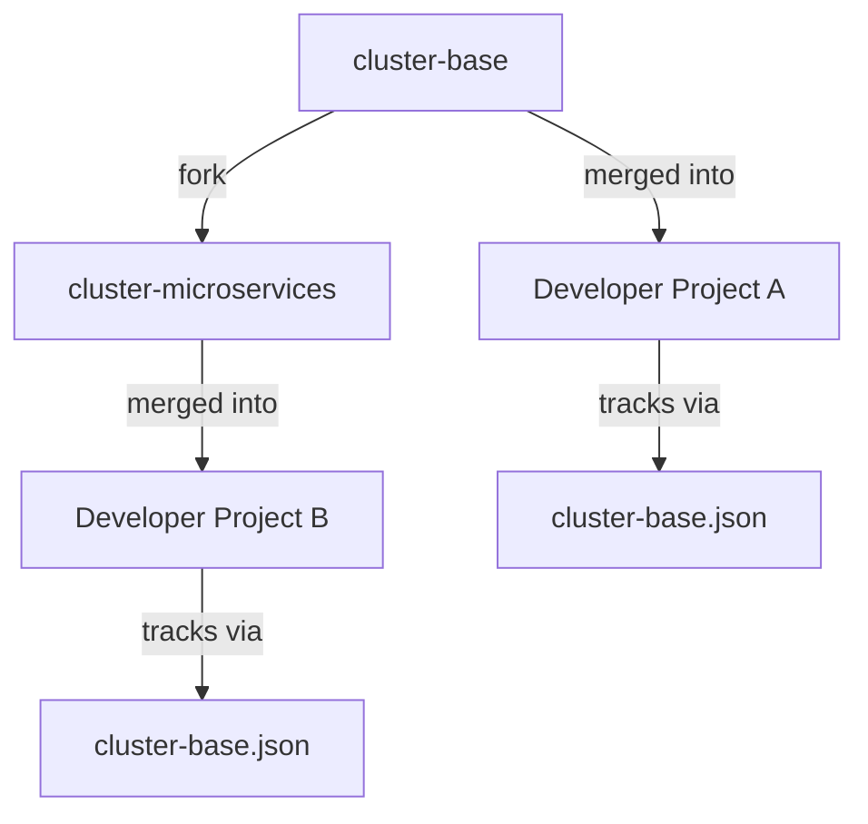

# Data Model: Update Getting-Started Docs for Cluster Base Repo Approach

## Core Entities

This is a documentation-only feature with no runtime data model changes. The following entities are documented in the new content and are relevant for understanding the domain.

### Cluster Base Repo Fork Chain

The fork chain defines the upstream relationship between base repos:

```
cluster-base                          ← Root: standard cluster setup (no DinD)
  └── cluster-microservices           ← Fork: adds Docker-in-Docker support
```

| Repo | Parent | Use Case |
|------|--------|----------|
| `cluster-base` | — (root) | Standard dev environment setup |
| `cluster-microservices` | `cluster-base` | Microservices with Docker-in-Docker |

### cluster-base.json

Tracking file created in developer projects to record the upstream relationship:

```jsonc
// Expected schema (confirm from migration plan)
{
  "upstream": "cluster-base",           // or "cluster-microservices"
  "remoteName": "cluster-base",         // git remote name
  "lastMergedCommit": "<sha>",          // last merged commit from upstream
  "mergedAt": "2026-03-12T00:00:00Z"   // timestamp of last merge
}
```

**Location**: Project root
**Created by**: Onboarding PR or manual setup
**Updated by**: Each `git merge` from upstream (via automation or manually)

### Git Remote Relationship

```
developer-project (origin)
  ├── remote: origin → github.com/org/developer-project
  └── remote: cluster-base → github.com/generacy-ai/cluster-base (or cluster-microservices)
```

## Validation Rules

- A project should track exactly one upstream base repo (either `cluster-base` or `cluster-microservices`, not both)
- The `remoteName` in `cluster-base.json` must match an actual git remote
- `lastMergedCommit` should be a valid commit SHA from the upstream repo

## Relationships



---

*Generated by speckit*
